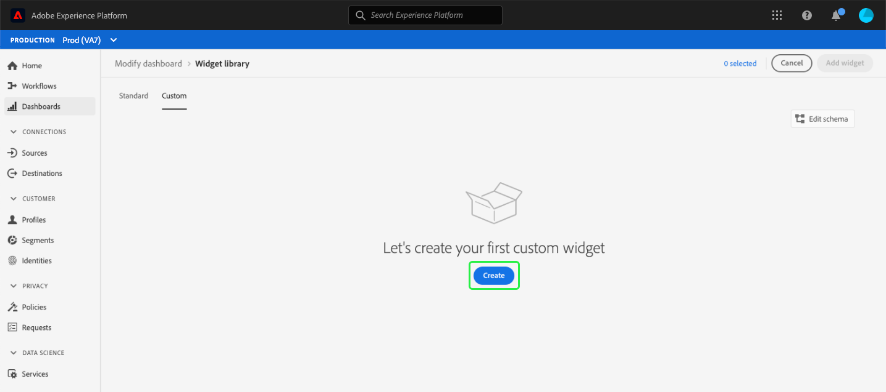
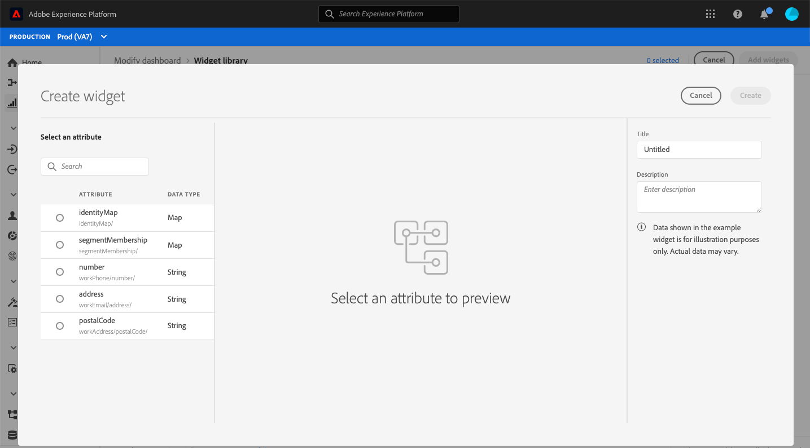
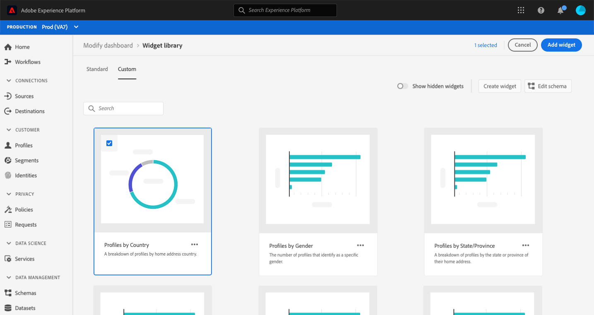
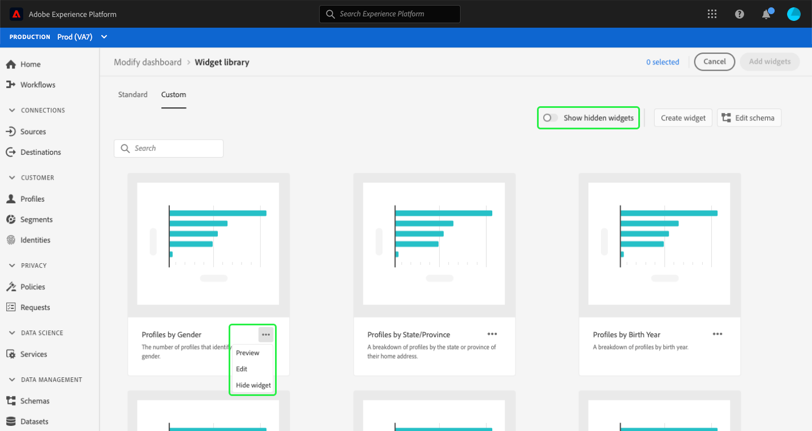
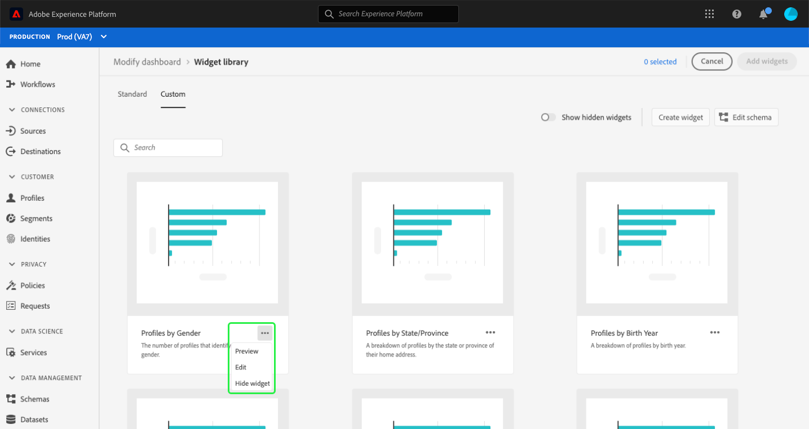

# Creating custom widgets for dashboards

In Adobe Experience Platform, you can view and interact with your organization's data using multiple dashboards. You can also update certain dashboards by adding new widgets to your dashboard view. In addition to the standard widgets provided by Adobe, you can also create custom widgets and share them throughout your organization. 

This guide provides step-by-step instructions for creating and adding custom widgets to the [!UICONTROL Profiles], [!UICONTROL Segments], and [!UICONTROL Destinations] dashboards in the Platform UI.

To learn more about standard widgets, please refer to the guide for [adding standard widgets to your dashboards](standard-widgets.md).

>[!NOTE]
>
>The widgets shown in the [!UICONTROL License usage] dashboard cannot be customized. To learn more about this unique dashboard, read the [license usage dashboard documentation](../guides/license-usage.md).

## Widget library {#widget-library}

This guide requires access to the [!UICONTROL Widget library] within Experience Platform. To learn more about the widget library, and how to access it within the UI, please begin by reading the [widget library overview](widget-library.md).

## Getting started with custom widgets

Within the widget library, the **[!UICONTROL Custom]** tab enables you to create widgets and share them with other users in your organization in order to customize the look of your dashboards. 

>[!IMPORTANT]
>
>Your organization can create a maximum of 20 custom widgets in the widget library.

Select the **[!UICONTROL Custom]** tab to begin creating custom widgets or to view custom widgets that your organization has already created. 

## Create a custom widget

To create a custom widget, select **[!UICONTROL Create widget]** from the top-right corner of the widget library or, if this is your organization's first custom widget, select **[!UICONTROL Create]** from the center of the widget library. 

In the **[!UICONTROL Create widget]** dialog, provide a title and description for your new widget and choose the attribute that you want the widget to display. 

>[!NOTE]
>
>The list of available attributes depends on the schema that has been configured for your organization. To learn more about attribute selection and schema configuration, read the guide on [editing the schema to create custom widgets](edit-schema.md).

To choose an attribute, select the radio button beside the attribute you want to add.

>[!NOTE]
>
>Only one attribute can be selected per widget and only one widget can be created per attribute. If a widget has already been created for an attribute, the attribute appears grayed out.

## Select a visualization

After selecting an attribute, a preview of the new widget appears in the dialog. Artificial intelligence is used to automatically select a visualization that best fits the attribute data, and to provide additional visualization options that you can select manually. 

Depending on the attribute, the AI recommends different visualization options. The complete list of visualizations includes:

* Horizontal bar chart: Horizontal lines are used to represent values.
* Vertical bar chart: Vertical lines are used to represent values.
* Donut chart: Similar to a pie chart, values are shown as parts or pieces of a whole.
* Scatterplot: Shows the relationship between values
* Line chart: Values are displayed using a single line to show changes over a period of time.
* Number card: Displays a summary number to represent a single key value.
* Data table: Values are displayed as rows in a table.

>[!NOTE]
>
>The only metric currently supported for all attributes is profile count. 
>
>Data shown in the example widget is for illustration purposes only. The preview does not display actual data from your organization.

To save your new widget and return to the [!UICONTROL Custom] tab, select **[!UICONTROL Create]**. 

Your new widget is now available to be added to a dashboard by choosing the widget from the library and selecting **[!UICONTROL Add widget]**.

## Hide a custom widget

After a widget has been added to the library, it can be hidden by selecting the ellipses (`...`) on the widget card and then selecting **[!UICONTROL Hide widget]**. You can also preview and edit the widget from the same dropdown.

To view widgets that have been hidden, select **[!UICONTROL Show hidden widgets]** from the top right corner of the widget library.

>[!WARNING]
>
>Hiding a widget in the library does not remove the widget from the dashboards of individual users. If a widget should no longer be used in your organization, please ensure that you communicate this directly to all Platform users as they will need to remove the widget from their dashboards.

## Edit a custom widget

You can edit custom widgets in the widget library by selecting the ellipses (`...`) on the widget card and then selecting **[!UICONTROL Edit]** from the dropdown menu. 

On the **[!UICONTROL Edit widget]** dialog, you can edit the title and description of the widget, as well as preview and select different visualizations. After your edits have been made, select **[!UICONTOL Save]** to save your changes and return to the custom widgets tab.

>[!WARNING]
>
>Editing a widget in the library does not update the widget for individual users. If a widget has been updated, please ensure that you communicate this directly to all Platform users as they will need to remove the outdated widget from their dashboards and then select and add the updated widget from the widget library.

## Next steps

After reading this document, you are able to access the widget library and use it to create and add custom widgets for your organization. To modify the size and location of widgets that appear in the dashboard, please refer to the [modify dashboards guide](modify.md).
