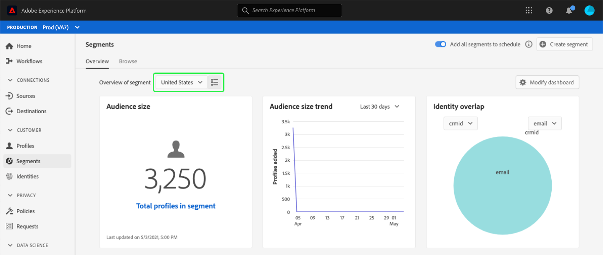
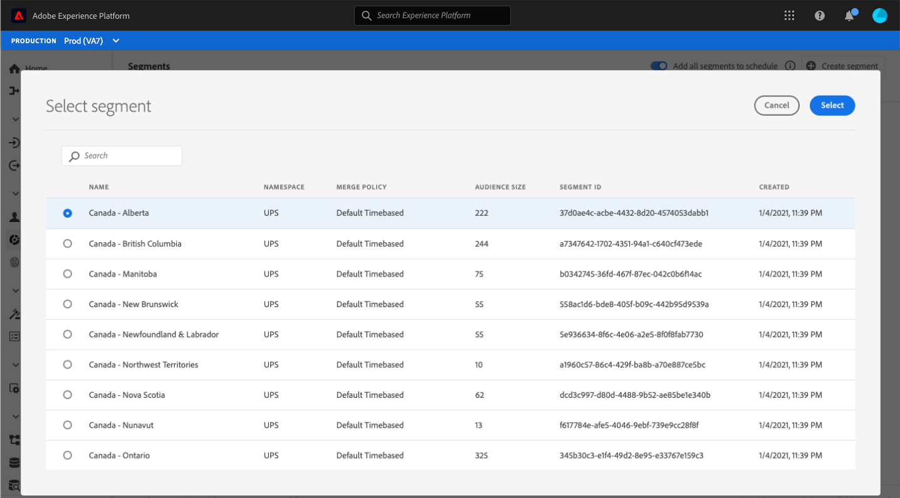
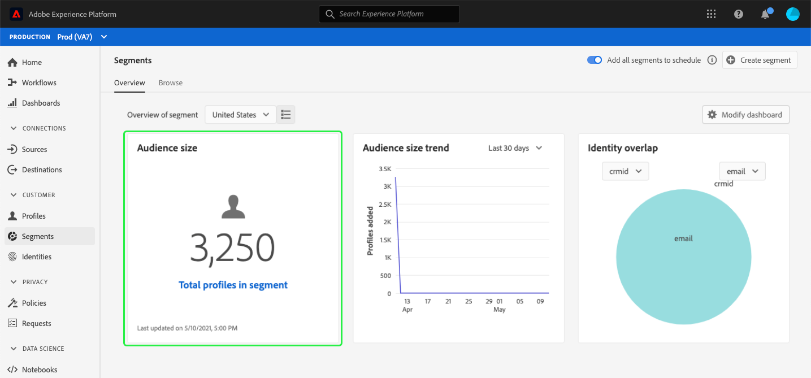
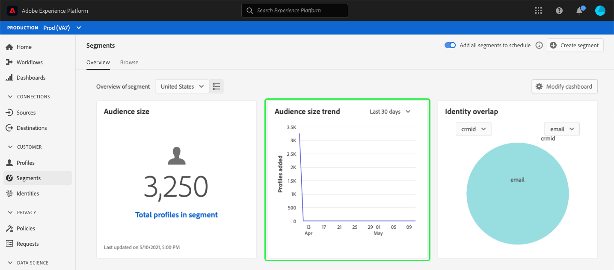
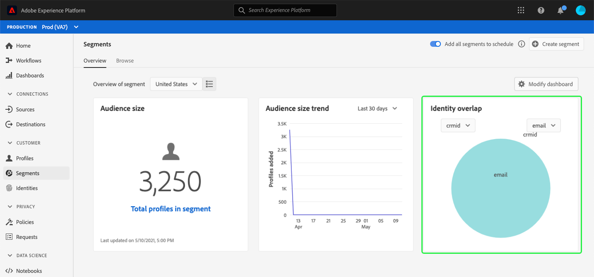
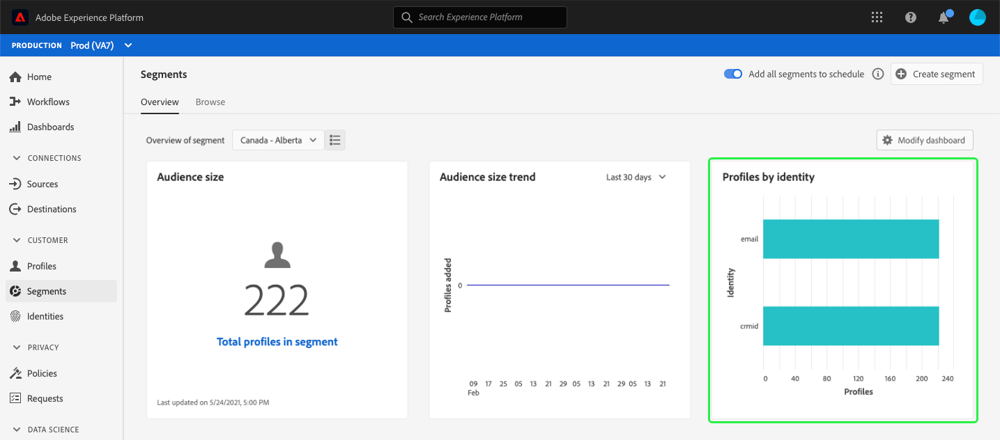

# Segments dashboard {#segment-dashboard}

The Adobe Experience Platform user interface (UI) provides a dashboard through which you can view important information about your segments, as captured during a daily snapshot. This guide outlines how to access and work with the segments dashboard in the UI and provides more information regarding the visualizations displayed in the dashboard.  

For an overview of all of the Adobe Experience Platform Segmentation Service features within the Platform user interface, please visit the [Segmentation Service UI guide](../../segmentation/ui/overview.md).

## Segment dashboard data

The segment dashboard displays a snapshot of the attribute (record) data that your organization has within the Profile store in Experience Platform. The snapshot does not include any event (time series) data. 

The attribute data in the snapshot shows the data exactly as it appears at the specific point in time when the snapshot was taken. In other words, the snapshot is not an approximation or sample of the data, and the segment dashboard is not updating in real time.

>[!NOTE]
>
>Any changes or updates made to the data since the snapshot was taken will not be reflected in the dashboard until the next snapshot is taken.

## Exploring the segment dashboard

To navigate to the segment dashboard within the Platform UI, select **[!UICONTROL Segments]** in the left rail, then select the **[!UICONTROL Overview]** tab to display the dashboard.

### Modifying the [!UICONTROL Segments] dashboard

You can modify the appearance of the [!UICONTROL Segments] dashboard by selecting **[!UICONTROL Modify dashboard]**. This enables you to move, add, and remove widgets from the dashboard as well as to access the [!UICONTROL Widget library] to explore available widgets and create custom widgets for your organization. 

Please refer to the [modifying dashboards](../modify.md) and [widget library](../widget-library.md) documentation to learn more.

## Select a segment

The dashboard automatically selects a segment to display, however you can change the segment by using the drop down menu or segment selector. 

To choose a different segment, select the drop down next to the segment name or use the segment selector to open the segment selection dialog.

## Widgets and metrics

The segments dashboard is composed of widgets, which are read-only metrics providing important information regarding your selected segment. 

The "last updated" date and time on a widget shows when the last snapshot of the data was taken. The date and time of the snapshot is provided in UTC; it is not in the timezone of the individual user or IMS Organization.

## Available widgets

Experience Platform provides multiple widgets that you can use to visualize different metrics related to your segment. Select the name of a widget below to learn more:

* [[!UICONTROL Audience size]](#audience-size)
* [[!UICONTROL Audience size trend]](#audience-size-trend)
* [[!UICONTROL Identity overlap]](#identity-overlap)
* [[!UICONTROL Profiles by identity]](#profiles-by-identity)

### [!UICONTROL Audience size] {#audience-size}

The **[!UICONTROL Audience size]** widget displays the total number of merged profiles within the selected segment at the time the snapshot was taken. This number is the result of applying the segment merge policy to your Profile data in order to merge profile fragments together to form a single profile for each individual in the segment. 

For more information on fragments and merged profiles, please begin by reading the [Real-time Customer Profile overview](../../profile/home.md).

### [!UICONTROL Audience size trend] {#audience-size-trend}

The **[!UICONTROL Audience size trend]** widget provides information regarding the total number of profiles in the segment as captured during the daily snapshot, for the last 30 days, 90 days, or 12 months. This widget displays how the segment size may have shifted over time as new profiles qualify for or exit from the segment. 

To learn more about segment evaluation and how profiles qualify and exit from segments, please refer to the [Segmentation Service documentation](../../segmentation/home.md).

### [!UICONTROL Identity overlap] {#identity-overlap}

The **[!UICONTROL Identity overlap]** widget displays a Venn diagram, or set diagram, showing the overlap of profiles in your segment containing multiple identities. 

After using the dropdown menus on the widget to select the identities that you wish to compare, circles appear displaying the relative size of each identity, with the number of profiles containing both namespaces being represented by the size of the overlap between the circles.

If a customer interacts with your brand on more than one channel, multiple identities will be associated with that individual customer, therefore it is likely that your organization will have multiple profiles containing fragments from more than one identity.

To learn more about identities, please visit the [Adobe Experience Platform Identity Service documentation](../../identity-service/home.md).

### [!UICONTROL Profiles by identity] {#profiles-by-identity}

The **[!UICONTROL Profiles by identity]** widget displays the breakdown of identities across all of the merged profiles in your selected segment. The total number of profiles by identity may be higher than the total number of profiles in the segment because one profile could have multiple identities associated with it. In other words, adding together the values shown for each identity may total more than the total audience size in the segment because if a customer interacts with your brand on more than one channel, multiple identities may be associated with that individual customer.

To learn more about identities, please visit the [Adobe Experience Platform Identity Service documentation](../../identity-service/home.md).

## Next steps

By following this document you should now be able to locate the segment dashboard and select a segment to view. You should also understand the metrics displayed in the available widgets. To learn more about working with segments in the Experience Platform UI, please refer to the [Segmentation Service UI guide](../../segmentation/ui/overview.md).
