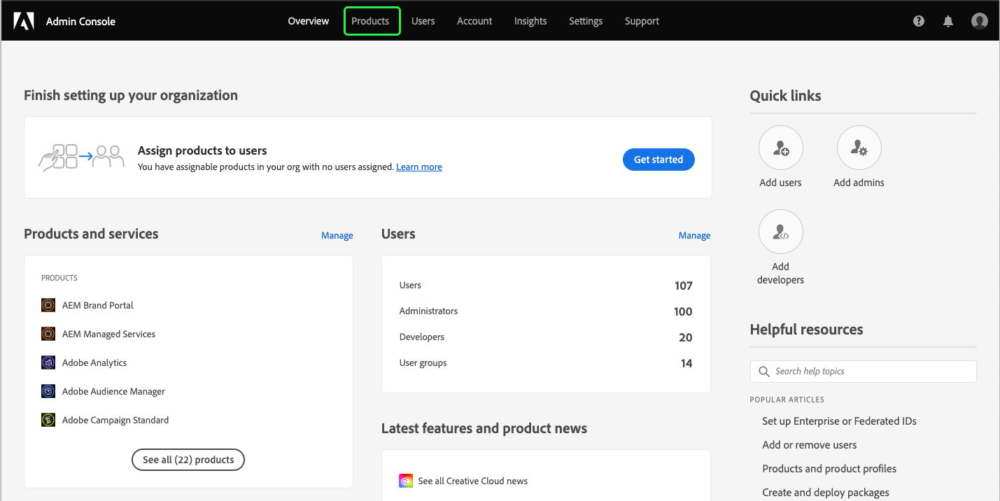
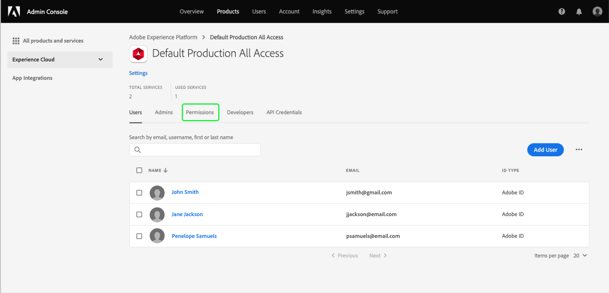

# Access permissions for dashboards

In order to grant users the ability to view, edit, and update dashboards, you must first enable permissions. In Adobe Experience Platform, access control is provided through the Adobe Admin Console. This functionality leverages product profiles in [!DNL Admin Console], which link users with permissions and sandboxes.

This document provides a summary of how to provide access to specific dashboard permissions within Admin Console. For detailed information on gaining and assigning access permissions, please begin by reading the [access control overview](../access-control/home.md).

>[!NOTE]
>
>In order to configure access control for [!DNL Experience Platform], you must have administrator privileges for an organization that has an [!DNL Experience Platform] product integration. See the Adobe Help Center article on [administrative roles](https://helpx.adobe.com/enterprise/using/admin-roles.html) for more information.

## Available permissions {#available-permissions}

There are two main permissions that are required to access dashboards within Experience Platform. These permissions are:

* **View License Usage Dashboard**: This permission allows users read-only access to the license usage dashboard within the Experience Platform UI.
* **Manage Standard Dashboards**: This permission allows users to add custom attributes that are not yet in the data warehouse.

The following steps will show you how to add these permissions using Admin Console.

## Select product profiles

To grant users access to dashboards in Experience Platform, begin by logging into [Adobe Admin Console](https://adminconsole.adobe.com) and selecting **Products** from the top navigation.

Select **Adobe Experience Platform** from the Experience Cloud dropdown in the left navigation or from the cards listed under *All products and services*. From the Adobe Experience Platform product page, select the product profile that you want to add the dashboard permissions to, or select **New Profile** to create a new product profile.

The selected product profile opens, showing the users associated with that product profile. To manage the permissions for the product profile, select **Permissions**.

## Add/edit permissions

The **Permissions** tab displays all of the available permissions for the product profile. Locate the **Dashboards** row and notice that it currently says "0 of 2 included", this means that there are no dashboard permissions enabled for the product profile.

To edit the dashboard permissions, select **Edit** on the dashboard row.

The **Edit Permissions** dialog opens, showing available permission items and included permission items. You can select the plus sign (`+`) next to the permission to add it or select **+ Add all** to add all of the permissions at once. 

For descriptions of the permissions, please refer to the [available permissions](#available-permissions) section earlier in this document.

>[!NOTE]
>
>You do not have to enable all permissions for all users. Depending on your organization's structure, you may wish to create separate product profiles for certain users and grant limited access (such as read-only).

After permissions have been added, select **Save** to return to the product profile.

When you return to the product profile, you can verify that the permissions have been added by confirming that the **Dashboards** row shows "2 of 2 included".

## Next steps

Now that you have added access permissions to dashboards, users within your organization can begin to view dashboards within the Experience Platform UI and perform other actions based on the permissions that you have assigned.