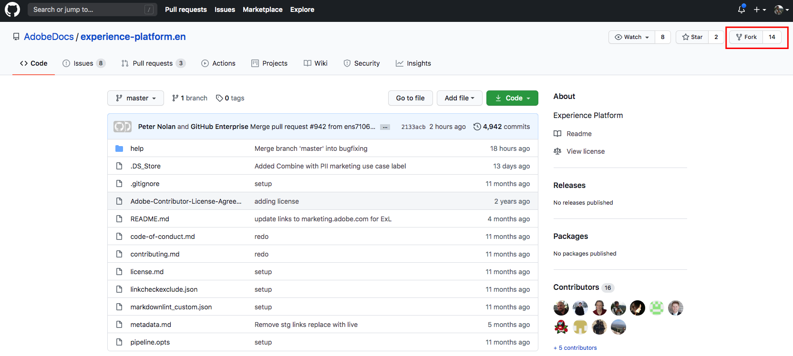
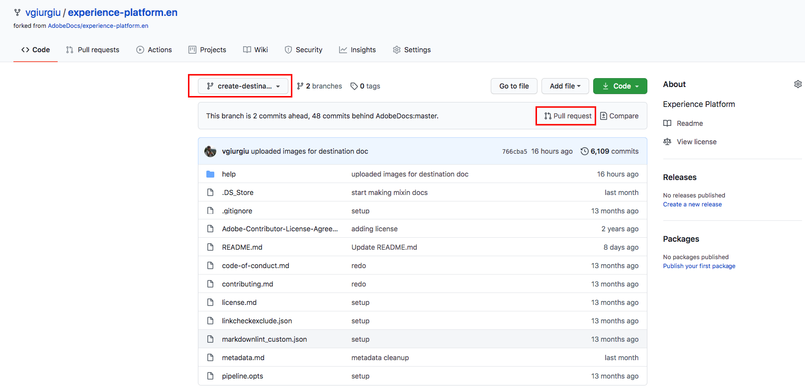

# Use the GitHub web interface to create a destination documentation page {#github-interface}

The instructions below show you how to use the GitHub web interface to author documentation and submit a pull request (PR). Before going through the steps indicated here, make sure you read [Document your destination in Adobe Experience Platform Destinations](./documentation-instructions.md).

>[!TIP]
>
>Refer also to the supporting documentation in Adobe's contributor guide:
>* [Install Git and Markdown Authoring tools](https://experienceleague.adobe.com/docs/contributor/contributor-guide/setup/install-tools.html?lang=en)
>* [Set up Git repository locally for documentation](https://experienceleague.adobe.com/docs/contributor/contributor-guide/setup/local-repo.html?lang=en)
>* [GitHub contribution workflow for major changes](https://experienceleague.adobe.com/docs/contributor/contributor-guide/setup/full-workflow.html?lang=en).

## Set up your GitHub authoring environment {#set-up-environment}

1. In your browser, navigate to `https://github.com/AdobeDocs/experience-platform.en`.
2. To [fork](https://experienceleague.adobe.com/docs/contributor/contributor-guide/setup/local-repo.html?lang=en#fork-the-repository) the repository, click **Fork** as shown in the image below.

   

3. In your fork of the repository, create a new branch for your project, as shown below. Use this new branch for your work.

   

4. In the GitHub folder structure of the forked repository, navigate to `experience-platform.en/help/destinations/catalog/[...]`, where `[...]` is the desired category for your destination. For example, if you are adding a personalization destination to Experience Platform, select the `personalization` category. Select **Add file > Create new file**.

   

5. Name your destination `YOURDESTINATION.md`, where YOURDESTINATION is the name of your destination in Adobe Experience Platform. For example, if your company is called Moviestar, you would name your file `moviestar.md`. You don't need to save your file yet.

## Author the documentation page for your destination {#author-documentation}

1. You will create the content of your destination page based on the [documentation self-service template](./self-service-template.md). **[Download](assets/yourdestination-template.zip)** the template and unzip it to extract the `.md` file template.
2. Paste and edit the content of the template with relevant information for your destination in an online markdown editor, such as [dillinger.io](https://dillinger.io/). Follow the instructions in the template for details on what you should fill in and which paragraphs can be removed.
3. Copy the content from the markdown editor into your new file in Github.
4. For any screenshots or images that you plan on using, use the GitHub interface to upload the files to `experience-platform.en/help/destinations/assets/catalog/[...]`, where `[...]` is the desired category for your destination. For example, if you are adding a personalization destination to Experience Platform, select the `personalization` category. You need to link to the images from the page you are authoring. See [instructions how to link to images](https://experienceleague.adobe.com/docs/contributor/contributor-guide/writing-essentials/linking.html?lang=en#link-to-images).

   

5.  When you are ready, save the file in your branch.

   

## Submit your documentation for review {#submit-review}

1.  After you saved the file and uploaded your desired images, you can open a pull request (PR) to merge your working branch into the master branch of the Adobe documentation repository. Make sure the branch that you worked on is selected and select **Pull request**.
   
   

1. Make sure that the base and compare branches are correct. Add a note to the PR, describing your update, and select **Create pull request**. This opens a PR to merge the working branch of your fork into the master branch of the Adobe repository. 
   
   >[!TIP]
   >
   >Leave the **Allow edits by maintainers** checkbox selected so that the Adobe documentation team can make edits to the PR. 
   
   

1. At this point, a notification appears that prompts you to sign the Adobe Contributor License Agreement (CLA). This is a mandatory step. After you sign the CLA, refresh the PR page and submit the pull request.

1. You can confirm that the pull request has been submitted by inspecting the **Pull requests** tab in `https://github.com/AdobeDocs/experience-platform.en`.

   

1. Thank you! The Adobe documentation team will reach out in the PR in case any edits are required and to let you know when the documentation will be published.

>[!TIP]
>
>To add images and links to your documentation, and for any other questions around Markdown, read [Using Markdown](https://experienceleague.adobe.com/docs/contributor/contributor-guide/writing-essentials/markdown.html?lang=en) in Adobe's collaborative writing guide.
