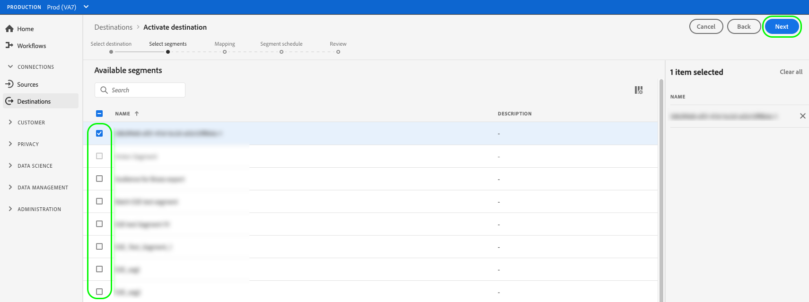
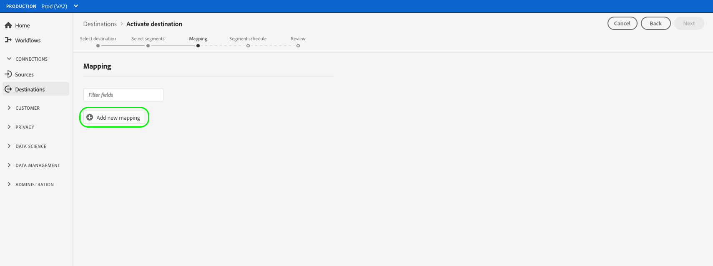
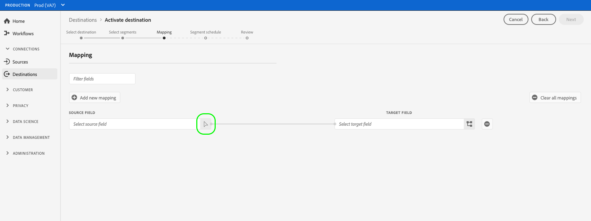
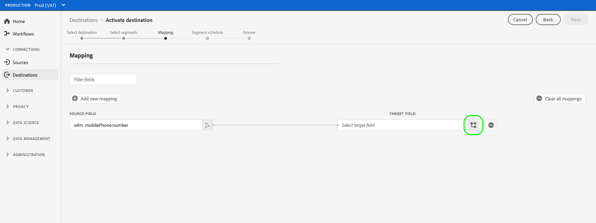
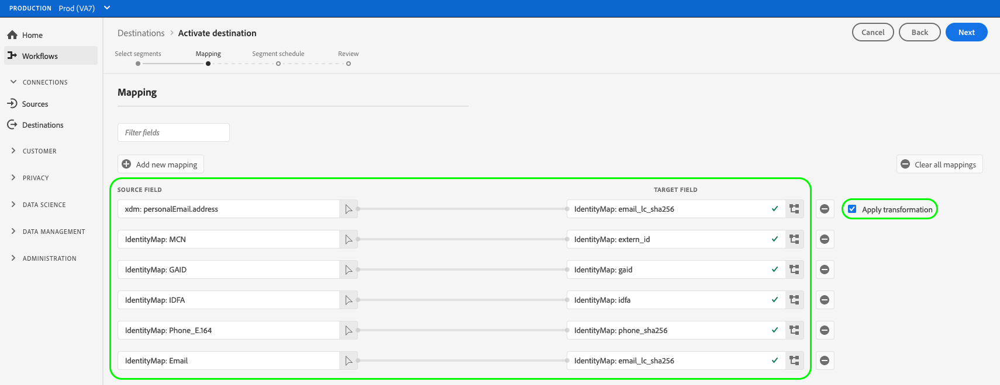
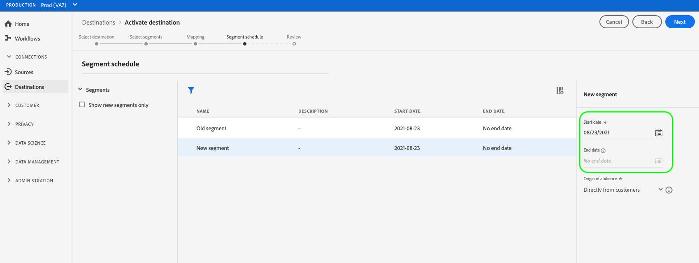
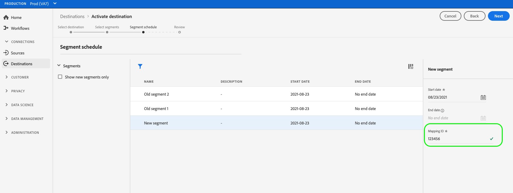
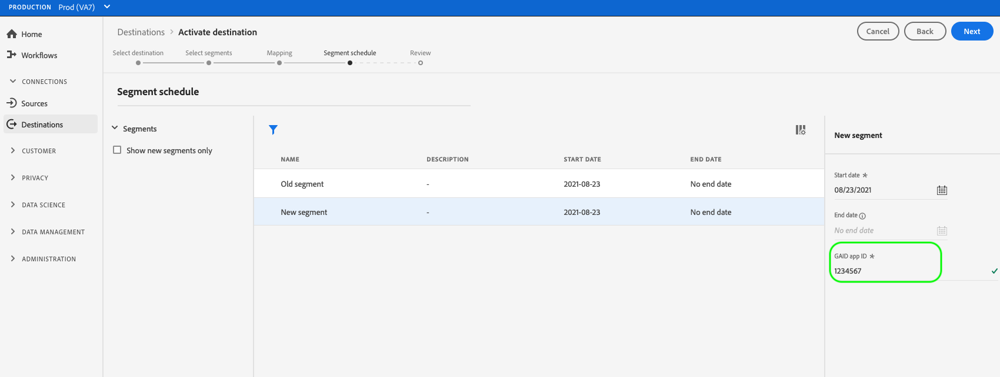
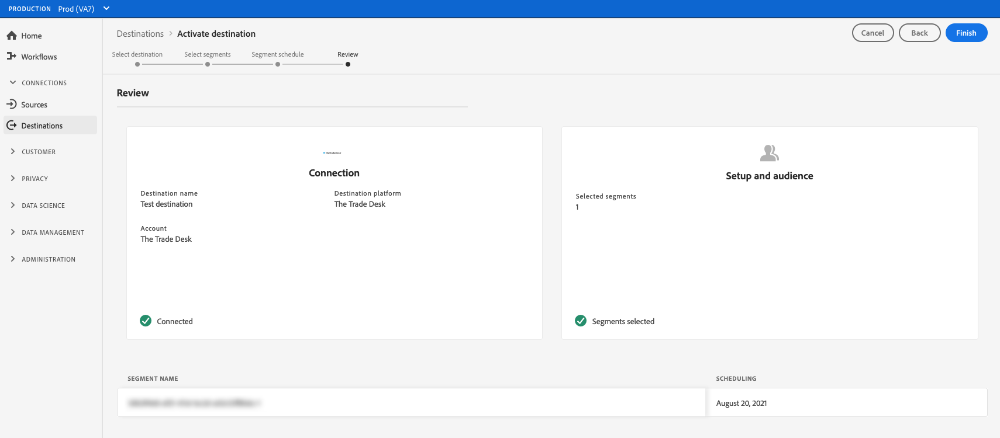

# Activate audience data to segment streaming destinations

## Overview {#overview}

This article explains the workflow required to activate audience data in Adobe Experience Platform segment streaming destinations.

## Prerequisites {#prerequisites}

To activate data to destinations, you must have successfully [connected to a destination](./connect-destination.md). If you haven't done so already, go to the [destinations catalog](../catalog/overview.md), browse the supported destinations, and configure the destination that you want to use.

## Select your destination {#select-destination}

1. Go to **[!UICONTROL Connections > Destinations]**, and select the **[!UICONTROL Browse]** tab.
    
    

1. Select the **[!UICONTROL Add segments]** button corresponding to the destination where you want to activate your segments, as shown in the image below.

    

1. Move to the next section to [select your segments](#select-segments).

## Select your segments {#select-segments}

Use the check boxes to the left of the segment names to select the segments that you want to activate to the destination, then select **[!UICONTROL Next]**.

## Map attributes and identities {#mapping}

>[!IMPORTANT]
>
>This step only applies to some segment streaming destinations. If your destinations does not have a **[!UICONTROL Mapping]** step, skip to [Schedule segment export](#scheduling).

Some segment streaming destinations require you to select source attributes or identity namespaces to map as target identities in the destination.

1. In the **[!UICONTROL Mapping]** page, select **[!UICONTROL Add new mapping]**.
    
    

1. Select the arrow to the right of the **[!UICONTROL Source field]** entry.

    

1. In the **[!UICONTROL Select source field]** page, use the **[!UICONTROL Select attributes]** or the **[!UICONTROL Select identity namespace]** options to switch between the two categories of available source fields. From the available [!DNL XDM] profile attributes and identity namespaces, select the ones that you want to map to the destination, then choose **[!UICONTROL Select]**.

    

1. Select the button to the right of the **[!UICONTROL Target field]** entry.

    

1. In the **[!UICONTROL Select target field]** page, select the target identity namespace that you want to map the source field to, and choose **[!UICONTROL Select]**.

    

1. To add more mappings, repeat steps 1 to 5.

### Mapping example: activating audience data in [!DNL Facebook Custom Audience] {#example-facebook}

Below is an example of correct identity mapping when activating audience data in [!DNL Facebook Custom Audience].

Selecting source fields:

* Select the `Email` namespace as source identity if the email addresses you are using are not hashed.
* Select the `Email_LC_SHA256` namespace as source identity if you hashed customer email addresses on data ingestion into [!DNL Platform], according to [!DNL Facebook] [email hashing requirements](../catalog/social/facebook.md#email-hashing-requirements).
* Select the `PHONE_E.164` namespace as source identity if your data consists of non-hashed phone numbers. [!DNL Platform] will hash the phone numbers to comply with [!DNL Facebook] requirements.
* Select the `Phone_SHA256` namespace as source identity if you hashed phone numbers on data ingestion into [!DNL Platform], according to [!DNL Facebook] [phone number hashing requirements](../catalog/social/facebook.md#phone-number-hashing-requirements).
* Select the `IDFA` namespace as source identity if your data consists of [!DNL Apple] device IDs. 
* Select the `GAID` namespace as source identity if your data consists of [!DNL Android] device IDs.
* Select the `Custom` namespace as source identity if your data consists of other type of identifiers.

Selecting target fields:

* Select the `Email_LC_SHA256` namespace as target identity when your source namespaces are either `Email` or `Email_LC_SHA256`.
* Select the `Phone_SHA256` namespace as target identity when your source namespaces are either `PHONE_E.164` or `Phone_SHA256`.
* Select the `IDFA` or `GAID` namespaces as target identity when your source namespaces are `IDFA` or `GAID`.
* Select the `Extern_ID` namespace as target identity when your source namespace is a custom one.

>[!IMPORTANT]
>
>Data from unhashed namespaces is automatically hashed by [!DNL Platform] upon activation.
> 
>Attribute source data is not automatically hashed. When your source field contains unhashed attributes, check the **[!UICONTROL Apply transformation]** option, to have [!DNL Platform] automatically hash the data on activation.

### Mapping example: activating audience data in [!DNL Google Customer Match] {#example-gcm}

This is an example of correct identity mapping when activating audience data in [!DNL Google Customer Match].

Selecting source fields:

* Select the `Email` namespace as source identity if the email addresses you are using are not hashed.
* Select the `Email_LC_SHA256` namespace as source identity if you hashed customer email addresses on data ingestion into [!DNL Platform], according to [!DNL Google Customer Match] [email hashing requirements](../catalog/social/../advertising/google-customer-match.md).
* Select the `PHONE_E.164` namespace as source identity if your data consists of non-hashed phone numbers. [!DNL Platform] will hash the phone numbers to comply with [!DNL Google Customer Match] requirements.
* Select the `Phone_SHA256_E.164` namespace as source identity if you hashed phone numbers on data ingestion into [!DNL Platform], according to [!DNL Facebook] [phone number hashing requirements](../catalog/social/../advertising/google-customer-match.md).
* Select the `IDFA` namespace as source identity if your data consists of [!DNL Apple] device IDs. 
* Select the `GAID` namespace as source identity if your data consists of [!DNL Android] device IDs.
* Select the `Custom` namespace as source identity if your data consists of other type of identifiers.

Selecting target fields:

* Select the `Email_LC_SHA256` namespace as target identity when your source namespaces are either `Email` or `Email_LC_SHA256`.
* Select the `Phone_SHA256_E.164` namespace as target identity when your source namespaces are either `PHONE_E.164` or `Phone_SHA256_E.164`.
* Select the `IDFA` or `GAID` namespaces as target identity when your source namespaces are `IDFA` or `GAID`.
* Select the `User_ID` namespace as target identity when your source namespace is a custom one.

Data from unhashed namespaces is automatically hashed by [!DNL Platform] upon activation.

Attribute source data is not automatically hashed. When your source field contains unhashed attributes, check the **[!UICONTROL Apply transformation]** option, to have [!DNL Platform] automatically hash the data on activation.

## Schedule segment export {#scheduling}

1. On the **[!UICONTROL Segment schedule]** page, select each segment, then use the **[!UICONTROL Start date]** and **[!UICONTROL End date]** selectors to configure the time interval for sending data to your destination.

    

    * Some destinations require you to select the **[!UICONTROL Origin of audience]** for each segment, using the drop-down menu underneath the calendar selectors. If your destination does not include this selector, skip this step.

    

    * Some destinations require you to manually map [!DNL Platform] segments to their counterpart in the target destination. To do this, select each segment, then enter the corresponding segment ID from the destination platform in the **[!UICONTROL Mapping ID]** field. If your destination does not include this field, skip this step.

    

    * Some destinations require you to enter an **[!UICONTROL App ID]** when activating [!DNL IDFA] or [!DNL GAID] segments. If your destination does not include this field, skip this step.

    

1. Select **[!UICONTROL Next]** to go to the [!UICONTROL Review] page.

## Review {#review}

On the **[!UICONTROL Review]** page, you can see a summary of your selection. Select **[!UICONTROL Cancel]** to break up the flow, **[!UICONTROL Back]** to modify your settings, or **[!UICONTROL Finish]** to confirm your selection and start sending data to the destination.

>[!IMPORTANT]
>
>In this step, Adobe Experience Platform checks for data usage policy violations. Shown below is an example where a policy is violated. You cannot complete the segment activation workflow until you have resolved the violation. For information on how to resolve policy violations, see [Policy enforcement](../../rtcdp/privacy/data-governance-overview.md#enforcement) in the data governance documentation section.
 

If no policy violations have been detected, select **[!UICONTROL Finish]** to confirm your selection and start sending data to the destination. 

## Verify segment activation {#verify}

Check your destination account. If activation was successful, audiences are populated in your destination platform.

<!-- 
For [!DNL Facebook Custom Audience], a successful activation means that a [!DNL Facebook] custom audience would be created programmatically in [[!UICONTROL Facebook Ads Manager]](https://www.facebook.com/adsmanager/manage/). Segment membership in the audience would be added and removed as users are qualified or disqualified for the activated segments.

>[!TIP]
>
>The integration between Adobe Experience Platform and [!DNL Facebook] supports historical audience backfills. All historical segment qualifications are sent to [!DNL Facebook] when you activate the segments to the destination. -->
