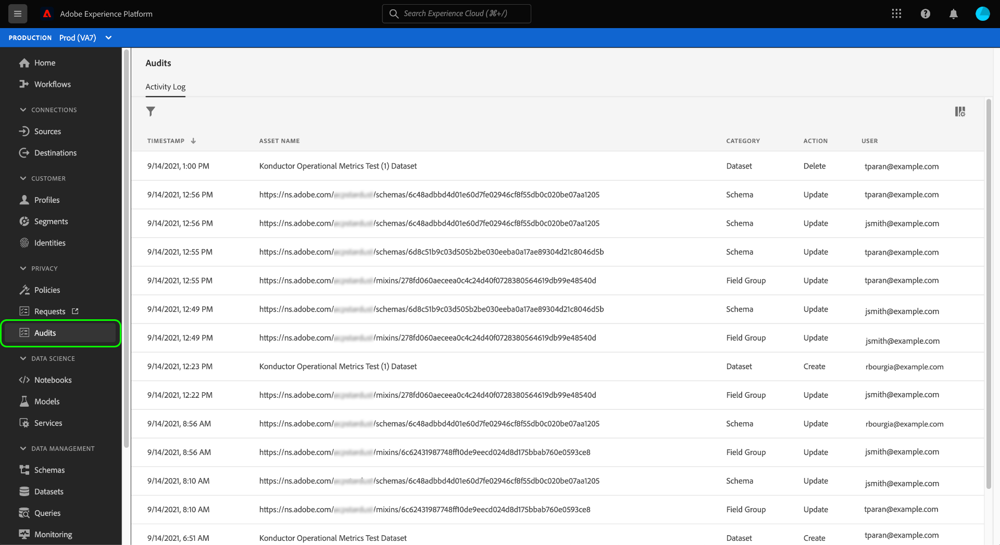
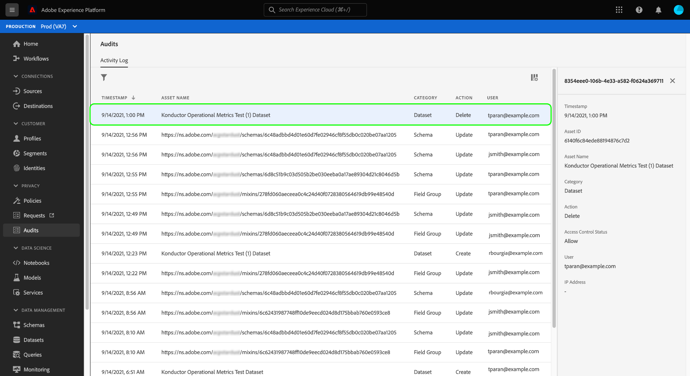

# Audit logs (Beta)

>[!IMPORTANT]
>
>The audit logs feature in Adobe Experience Platform is currently in beta. The functionality described in this documentation is subject to change.

In order to increase the transparency and visibility of activities performed in the system, Adobe Experience Platform allows you to audit user activity for various services and capabilities in the form of "audit logs". These logs form an audit trail that can help with troubleshooting issues on Platform, and help your business effectively comply with corporate data stewardship policies and regulatory requirements.

In a basic sense, an audit log tells **who** performed **what** action, and **when**. Each action recorded in a log contains metadata that indicates the action type, date and time, the email ID of the user who performed the action, and additional attributes relevant to the action type.

This document covers audit logs in Platform, including how to view and manage them in UI or API.

## Event types captured by audit logs

The following table outlines which actions on which resources are recorded by audit logs:

| Resource | Actions |
| --- | --- |
| [Sandbox](../../../sandboxes/home.md) | <ul><li>Create</li><li>Update</li><li>Reset</li><li>Delete</li></ul> |
| [Dataset](../../../catalog/datasets/overview.md) | <ul><li>Create</li><li>Update</li><li>Delete</li><li>Enable for [Real-time Customer Profile](../../../profile/home.md)</li></ul> |
| [Schema](../../../xdm/schema/composition.md) | <ul><li>Create</li><li>Update</li><li>Delete</li></ul> |
| [Field group](../../../xdm/schema/composition.md#field-group) | <ul><li>Create</li><li>Update</li><li>Delete</li></ul> |
| [Destination](../../../destinations/home.md) | <ul><li>Activate</li></ul> |

## Access to audit logs

When the feature is enabled for your organization, audit logs are automatically collected as activity occurs. You do not need to manually enable log collection.

In order to view and export audit logs, you must have the "View Audit Logs" access control permission granted. To learn how to manage individual permissions for Platform features, please refer to the [access control documentation](../../../access-control/home.md).

## Managing audit logs in the UI

You can view audit logs for different Experience Platform features within the **[!UICONTROL Audits]** workspace in the Platform UI. The workspace shows a list of recorded logs, by default sorted from most recent to least recent.

The system only displays audit logs from the last year. Any logs that exceed this limit are automatically removed from the system.

Select an event from the list to view its details in the right rail.

<!-- (Planned for post-beta release)
### Export an audit log

Select **[!UICONTROL Download log]** to export an audit log.
-->

## Managing audit logs in the API

All actions that you can perform in the UI can also be done using API calls. See the [API reference document](https://www.adobe.io/apis/experienceplatform/home/api-reference.html#!acpdr/swagger-specs/audit-query.yaml) for more information.

## Next steps

This guide covered how to manage audit logs in Experience Platform. For more information on how to monitor Platform activities, see the documentation on [Observability Insights](../../../observability/home.md) and [monitoring data ingestion](../../../ingestion/quality/monitor-data-ingestion.md).

To learn how to manage audit logs for activities in Adobe Admin Console, refer to the following [document](https://helpx.adobe.com/enterprise/using/audit-logs.html).