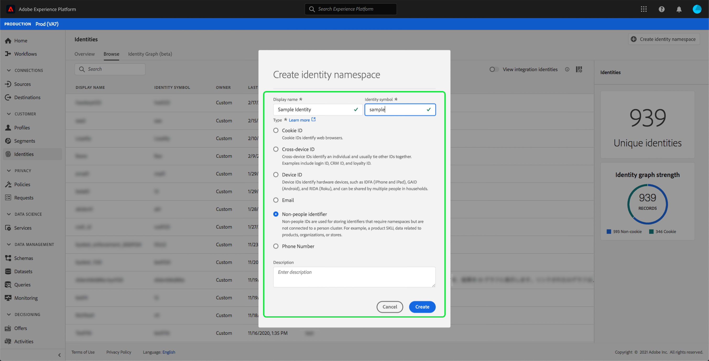
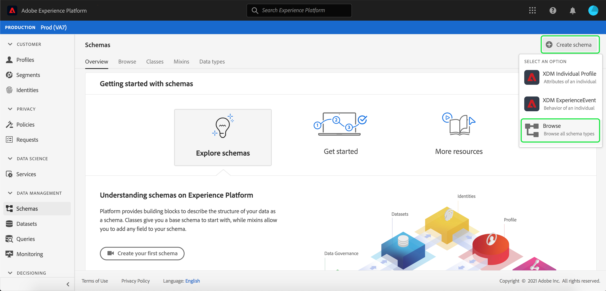
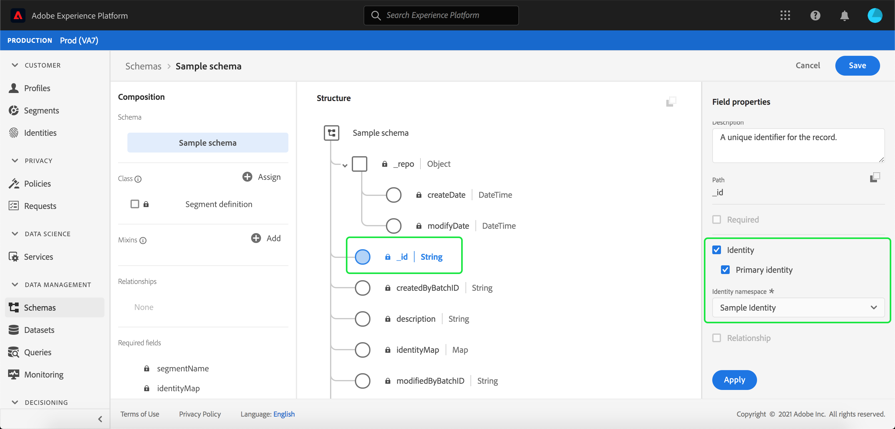
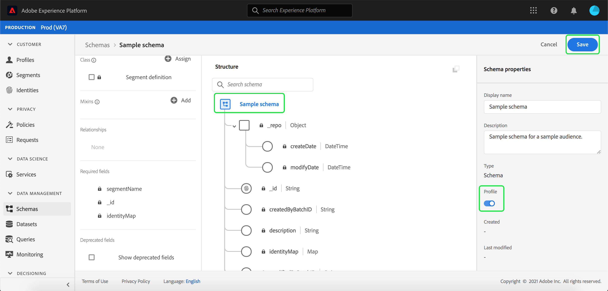
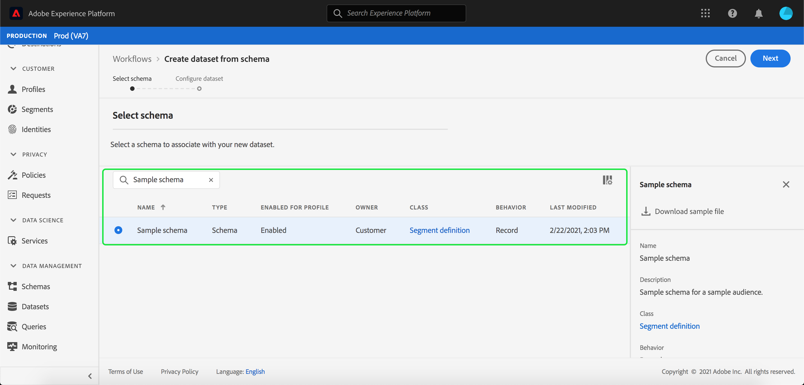
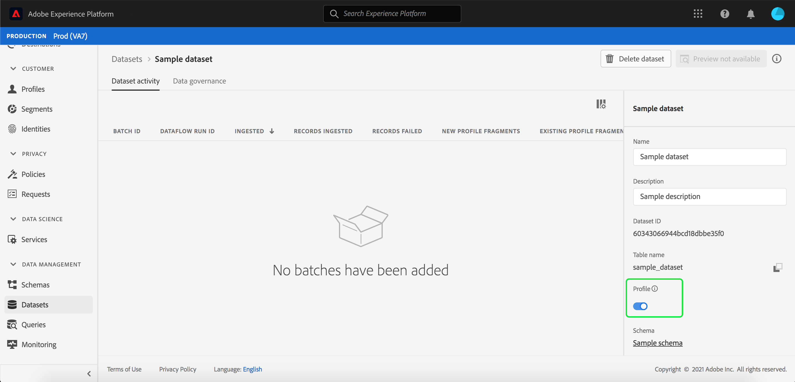
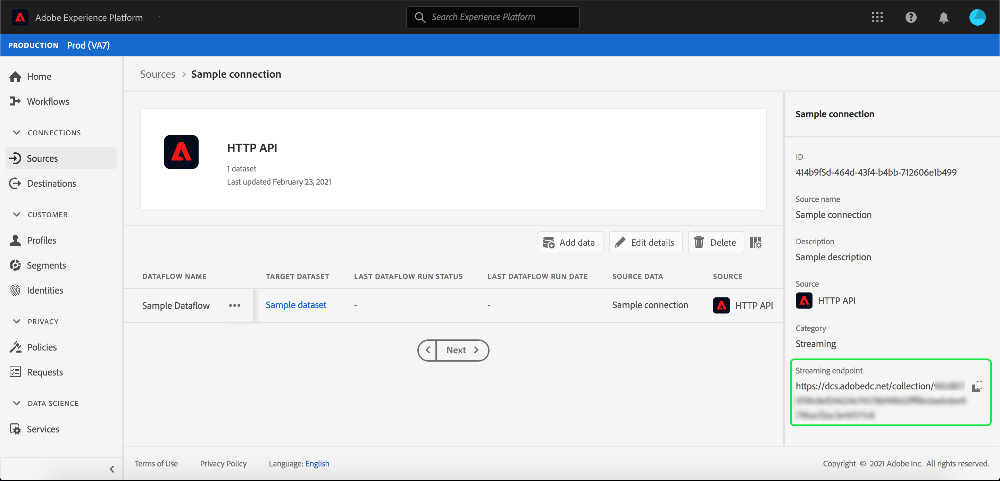
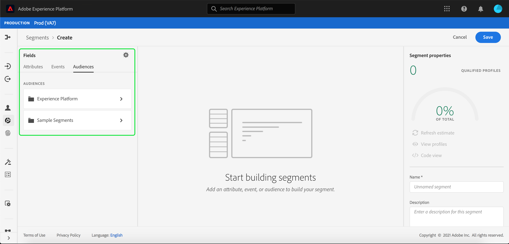

# Importing and using external audiences

Adobe Experience Platform supports the ability to import external audience, which can subsequently be used as components for a new segment definition. This document provides a tutorial for setting up Experience Platform to import and use external audiences.

## Getting started

- [Segmentation Service](../home.md): Allows you to build audience segments from Real-time Customer Profile data.
- [Real-time Customer Profile](../../profile/home.md): Provides a unified, real-time consumer profile based on aggregated data from multiple sources.
- [Experience Data Model (XDM)](../../xdm/home.md): The standardized framework by which Platform organizes customer experience data.
- [Datasets](../../catalog/datasets/overview.md): The storage and management construct for data persistence in Experience Platform.
- [Streaming ingestion](../../ingestion/streaming-ingestion/overview.md): How Experience Platform ingests and stores data from client- and server-side devices in real time.

## Create an identity namespace for the external audience

The first step for using external audiences is creating an identity namespace. Identity namespaces allow Platform to associate where a segment originates from.

To create an identity namespace, follow the instructions in the [identity namespace guide](../../identity-service/namespaces.md#manage-namespaces). When creating your identity namespace, add the source details to the identity namespace, and mark its [!UICONTROL Type] as a **[!UICONTROL Non-people identifier]**.

## Create a schema for the segment metadata

After creating an identity namespace, you need to create a new schema for the segment you will create.

To begin composing a schema, first select **[!UICONTROL Schemas]** on the left navigation bar, followed by the **[!UICONTROL Create schema]** in the top right corner of the Schemas workspace. From here, select **[!UICONTROL Browse]** to see a full selection of the available Schema types.

 

Since you are creating a segment definition, which is a pre-defined class, select **[!UICONTROL Use existing class]**. Now, select the **[!UICONTROL Segment definition]** class, followed by **[!UICONTROL Assign class]**. 

Now that your schema has been created, you will need to specify which field will contain the segment ID. This field should be marked as the primary identity and assigned to the namespaces you previously created.

After marking the `_id` field as the primary identity, select the title of the schema, followed by the toggle labelled **[!UICONTROL Profile]**. Select **[!UICONTROL Enable]** to enable the schema for [!DNL Real-time Customer Profile].

Now, this schema is enabled for Profile, with the primary identification assigned to the non-person identity namespace you created. As a result, this means that segment metadata imported into Platform using this schema will be ingested into Profile without being merged with other people-related Profile data.

## Create a dataset for the schema

After configuring the schema, you will need to create a dataset for the segment metadata. 

To create a dataset, follow the instructions in the [dataset user guide](../../catalog/datasets/user-guide.md#create). You'll want to follow the **[!UICONTROL Create dataset from schema]** option, using the schema you previously created.

After creating the dataset, continue following the instructions in the [dataset user guide](../../catalog/datasets/user-guide.md#enable-profile) to enable this dataset for Real-time Customer Profile.

## Set up and import audience data

With the dataset enabled, data can now be sent into Platform either through the UI or using the Experience Platform APIs. To ingest this data into Platform, you will need to create a streaming connection.

To create a streaming connection, you can follow the instructions in either the [API tutorial](../../sources/tutorials/api/create/streaming/http.md) or the [UI tutorial](../../sources/tutorials/ui/create/streaming/http.md).

Once you have created your streaming connection, you will have access to your unique streaming endpoint which you can send your data to. To learn how to send data to these endpoints, please read the [tutorial on streaming record data](../../ingestion/tutorials/streaming-record-data.md#ingest-data).

## Building segments using imported audiences

Once the imported audiences have been set up, they can be used as part of the segmentation process. To find external audiences, go to the Segment Builder, and select **[!UICONTROL Audiences]** tab in the **[!UICONTROL Fields]** section.

## Next steps

Now that you can use external audiences in your segments, you can use the Segment Builder to create segments. To learn how to create segments, please read the [tutorial on creating segments](./create-a-segment.md).
