# Create an Adobe Analytics source connection in the UI

This tutorial provides steps for creating an Adobe Analytics source connection in the UI to bring [!DNL Analytics] report suite data into Adobe Experience Platform.

## Getting started

This tutorial requires a working understanding of the following components of Adobe Experience Platform:

* [Experience Data Model (XDM) System](../../../../../xdm/home.md): The standardized framework by which Experience Platform organizes customer experience data.
* [Real-time Customer Profile](../../../../../profile/home.md): Provides a unified, real-time consumer profile based on aggregated data from multiple sources.
* [Sandboxes](../../../../../sandboxes/home.md): Experience Platform provides virtual sandboxes which partition a single Platform instance into separate virtual environments to help develop and evolve digital experience applications.

### Key terminology

It is important to understand the following key terms used throughout this document:

* **Standard attribute**: Standard attributes are any attribute that is pre-defined by Adobe. They contain the same meaning for all customers and are available in the [!DNL Analytics] source data and [!DNL Analytics] schema field groups.
* **Custom attribute**: Custom attributes are any attribute in the custom dimension hierarchy in [!DNL Analytics]. They are also among the Adobe-defined schemas, but can be interpreted differently by different customers. Custom attributes include eVars, Props, and lists.
* **Any attribute in Custom field groups**: Attributes that originate from schema field groups created by customers are all user-defined and are considered to be neither standard nor custom attribute.
* **Friendly names**: DEFINITION TO BE ADDED

## Create a source connection with Adobe Analytics

In the Platform UI, select **[!UICONTROL Sources]** from the left navigation to access the [!UICONTROL Sources] workspace. The [!UICONTROL Catalog] screen displays a variety of sources that you can create an account with.

You can select the appropriate category from the catalog on the left-hand side of your screen. Alternatively, you can find the specific source you wish to work with using the search option.

Under the **[!UICONTROL Adobe applications]** category, select **[!UICONTROL Adobe Analytics]** and then select **[!UICONTROL Add data]**.

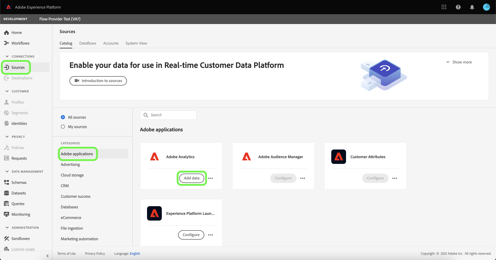

### Select data

The **[!UICONTROL Analytics source add data]** step appears. Select [!UICONTROL Report suite] to start creating a source connection for Analytics report suite data, and then select the report suite you would like to ingest. Select [!UICONTROL Next] to proceed.

>[!NOTE]
>
>Multiple in-bound connections to a source can be made for bringing in different data.

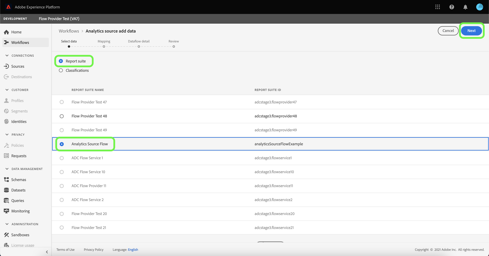

<!---Analytics report suites can be configured for one sandbox at a time. To import the same report suite into a different sandbox, the dataset flow will have to be deleted and instantiated again via configuration for a different sandbox.--->

### Mapping

The [!UICONTROL Mapping] page provides an interface to map source fields to their appropriate target schema fields. From here, you can map custom variables to new schema field groups and apply calculations as supported by Data Prep. Select a target schema to start the mapping process.

>[!TIP]
>
>You must create a new schema if there are no appropriate schemas available for your report suite data. For detailed steps on creating schemas, see the guide on [creating and editing schemas in the UI](../../../../../xdm/ui/resources/schemas.md).

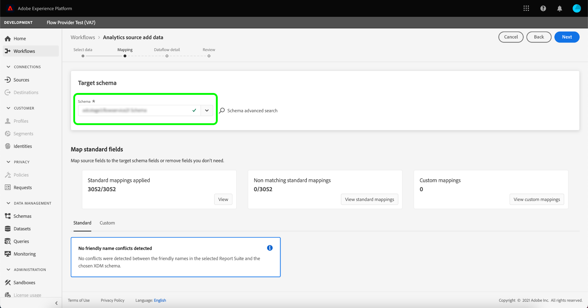

The [!UICONTROL Map standard fields] section displays panels for [!UICONTROL Standard mappings applied], [!UICONTROL Non matching standard mappings] and [!UICONTROL Custom mappings]. See the following table for specific information regarding each category:

| Map standard fields | Description |
| --- | --- |
| [!UICONTROL Standard mappings applied] | The [!UICONTROL Standard mappings applied] panel displays the total number of mapped standard attributes. Standard mappings refer to mapping sets between standard attributes in the source [!DNL Analytics] data and standard attributes in [!DNL Analytics] field group. These are pre-mapped and cannot be edited. |
| [!UICONTROL Non matching standard mappings] | The [!UICONTROL Non matching standard mappings] panel refers to the number of mapped standard attributes that contain friendly name conflicts. |
| [!UICONTROL Custom mappings] | The [!UICONTROL Custom mappings] panel displays the number of mapped custom attributes, including eVars, props, and lists. Custom mappings refer to mapping sets between custom attributes in the source [!DNL Analytics] data and custom attributes in [!DNL Analytics] field group. Custom attributes can be mapped to other custom attributes, as well as standard attributes. |

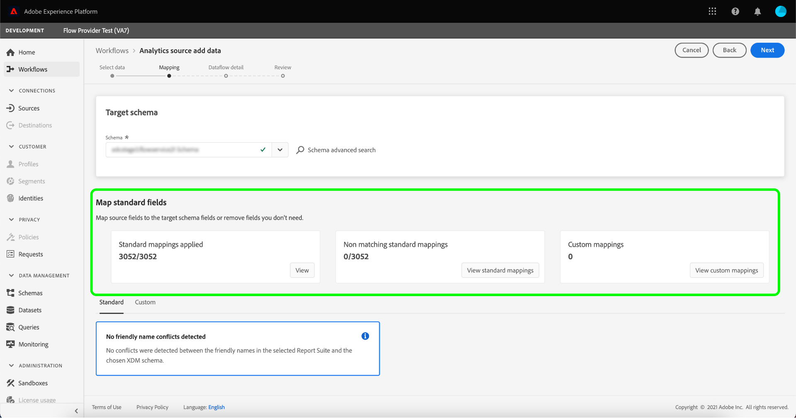

To preview the [!DNL Analytics] ExperienceEvent template schema field group, select **[!UICONTROL View]** in the [!UICONTROL Standard mappings applied] panel.

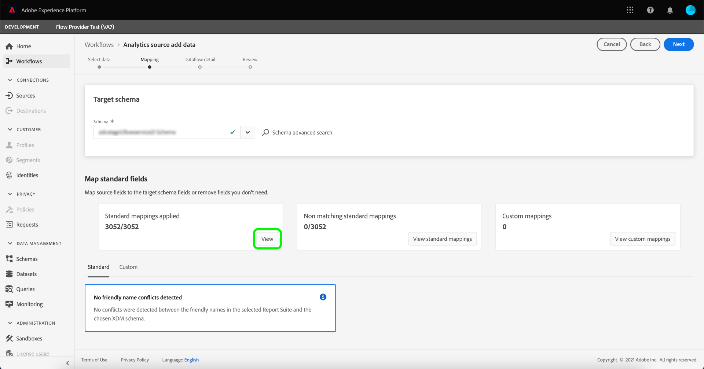

The [!UICONTROL Adobe Analytics ExperienceEvent Template Schema Field Group] page provides you with an interface to use for inspecting the structure of your schema. When finished, select **[!UICONTROL Close]**.

Platform automatically detects your mapping sets for any friendly name conflicts. If there are no conflicts with your mapping sets, select **[!UICONTROL Next]** to proceed.

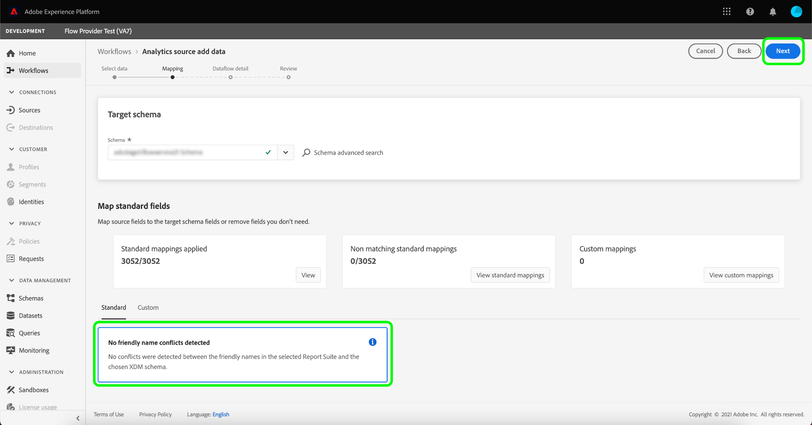

You can still proceed and create an [!DNL Analytics] dataflow even if your mapping sets contain name conflicts. Select **[!UICONTROL Next]** to proceed.

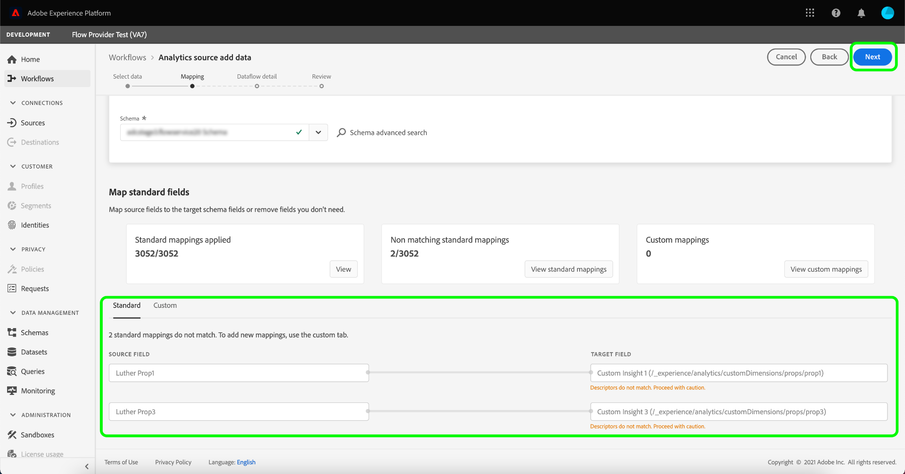

#### Custom mappings

To use Data Prep functions and add new mapping or calculated fields for custom attributes, select **[!UICONTROL View custom mappings]**.

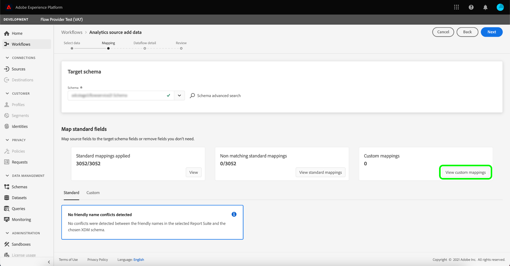

Next, select **[!UICONTROL Add new mapping]**.

Depending on your needs, you can select either **[!UICONTROL Add new mapping]** or **[!UICONTROL Add calculated field]** from the options that appear. 

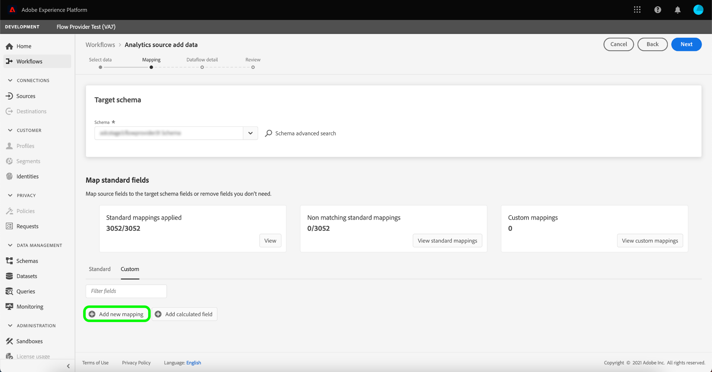

An empty mapping set appears. Select the mapping icon to add a source field.

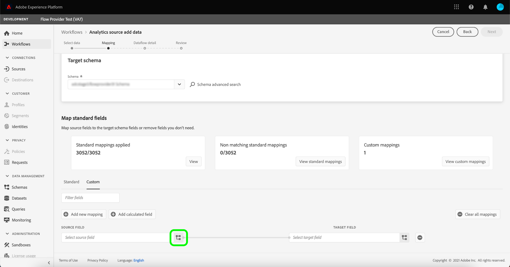

You can use the interface to navigate through the source schema structure and identify the new source field that you want to use. Once you have selected the source field that you want to map, select **[!UICONTROL Select]**.

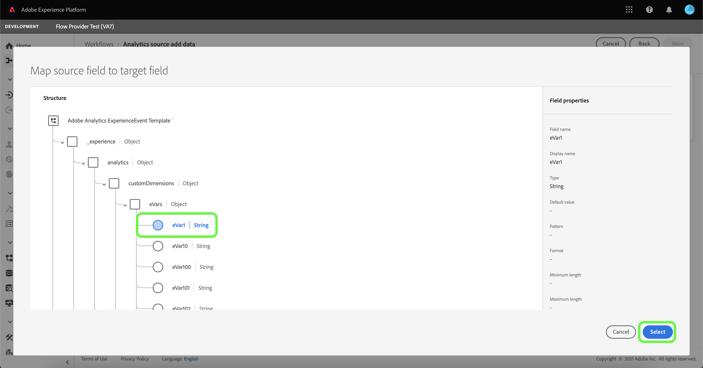

Next, select the mapping icon under [!UICONTROL Target Field] to map your selected source field to its appropriate target field.

Similar to the source schema, you can use the interface to navigate through the target schema structure and select the target field you want to map to. Once you have selected the appropriate target field, select **[!UICONTROL Select]**.

With your custom mapping set completed, select **[!UICONTROL Next]** to proceed.

The following documentation provides further resources on understanding Data Prep, calculated fields, and mapping functions:

* [Data Prep overview](../../../../../data-prep/home.md)
* [Data Prep mapping functions](../../../../../data-prep/functions.md)
* [Map a CSV file to an XDM schema and add calculated fields](../../../../../ingestion/tutorials/map-a-csv-file.md#add-calculated-field)

### Provide dataflow details

The **[!UICONTROL Dataflow detail]** step appears, where you must provide a name and an optional description for the dataflow. Select **[!UICONTROL Next]** when finished.

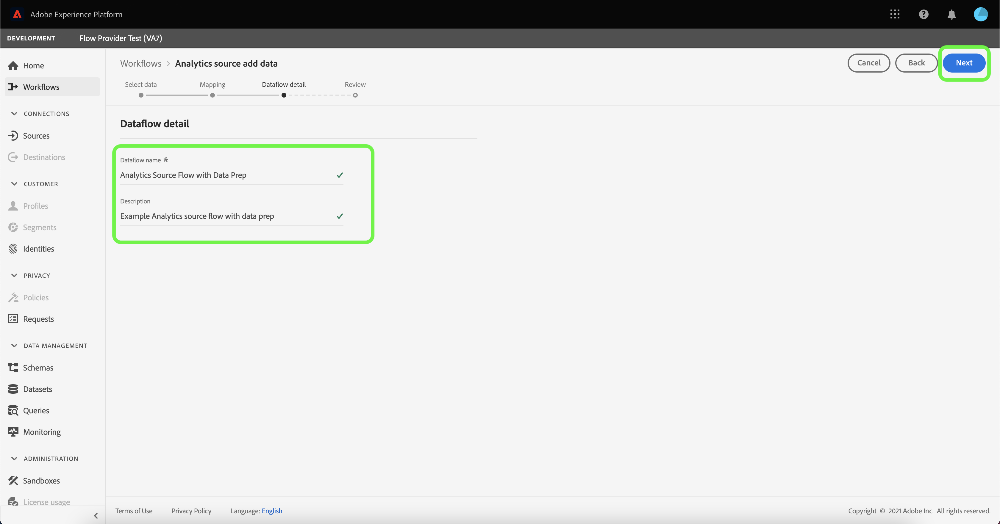

### Review

The [!UICONTROL Review] step appears, allowing you to review your new Analytics dataflow before it is created. Details of the connection are grouped by categories, including:

* [!UICONTROL Connection]: Displays the source platform of the connection.
* [!UICONTROL Data type]: Displays the selected report suite and its corresponding report suite ID.

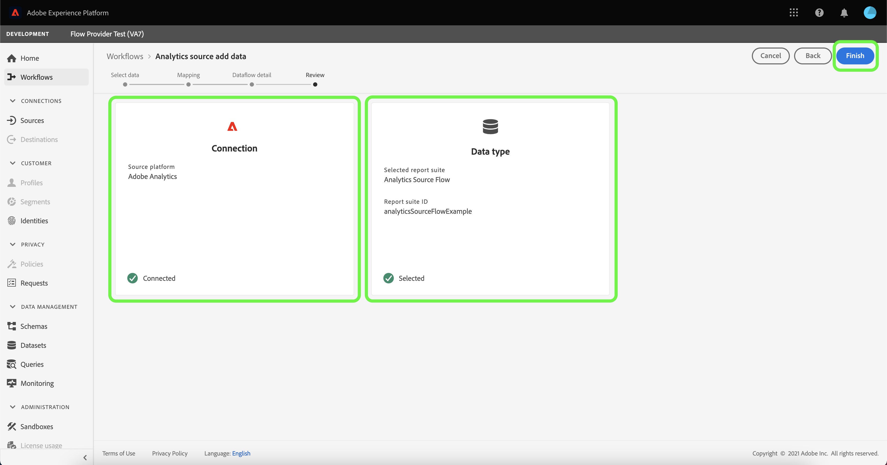

### Monitor your dataflow

Once your dataflow has been created, you can monitor the data that is being ingested through it. From the **[!UICONTROL Catalog]** screen, select **[!UICONTROL Dataflows]** to view a list of established flows associated with your Analytics account.

The **Dataflows** screen appears. On this page is a pair of dataset flows, including information about their name, source data, creation time, and status.

The connector instantiates two dataset flows. One flow represents backfill data and the other is for live data. Backfill data is not configured for Profile but is sent to the data lake for analytical and data-science use-cases.

For more information on backfill, live data, and their respective latencies, see the [Analytics Data Connector overview](../../../../connectors/adobe-applications/analytics.md).

Select the dataset flow you wish to view from the list.

The **Dataset activity** page appears. This page displays the rate of messages being consumed in the form of a graph. Select *Data governance* from the top header to access the labelling fields.

You can view a dataset flow's inherited labels from the *Data governance* screen. To access specific labels, select the edit button on the top right.

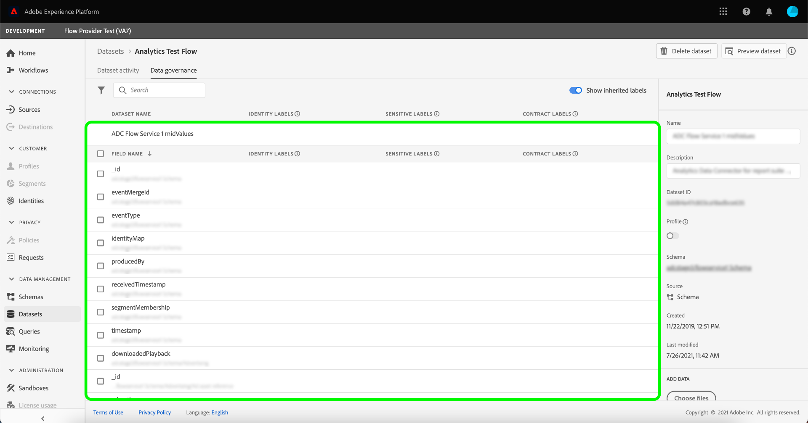

The **Edit governance labels** panel appears. This screen allows you to access and edit a dataset flow's contract, identity, and sensitive labels.

For more information on how to label data coming from Analytics, visit the [data usage labels guide](../../../../../data-governance/labels/user-guide.md).

## Next steps and additional resources

Once the connection is created, a target schema and dataset flow is automatically created to contain the incoming data. Furthermore, data back-filling occurs and ingests up to 13 months of historical data. When the initial ingestion completes, Analytics data and be used by downstream Platform services such as Real-time Customer Profile and Segmentation Service. See the following documents for more details:

* [Real-time Customer Profile overview](../../../../../profile/home.md)
* [Segmentation Service overview](../../../../../segmentation/home.md)
* [Data Science Workspace overview](../../../../../data-science-workspace/home.md)
* [Query Service overview](../../../../../query-service/home.md)

The following video is intended to support your understanding of ingesting data using the Adobe Analytics Source connector:

>[!WARNING]
>
> The [!DNL Platform] UI shown in the following video is out-of-date. Please refer to the documentation above for the latest UI screenshots and functionality.

>[!VIDEO](https://video.tv.adobe.com/v/29687?quality=12&learn=on)
