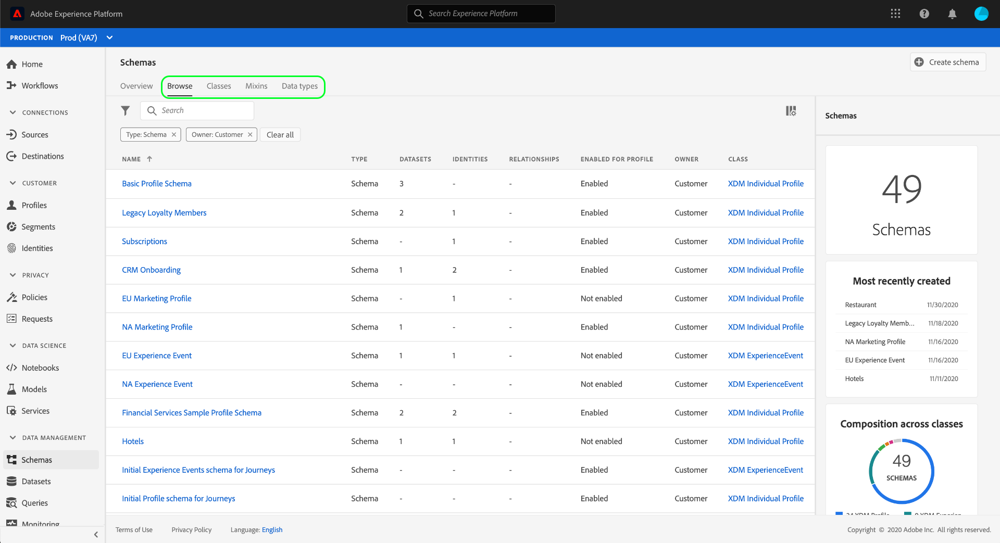
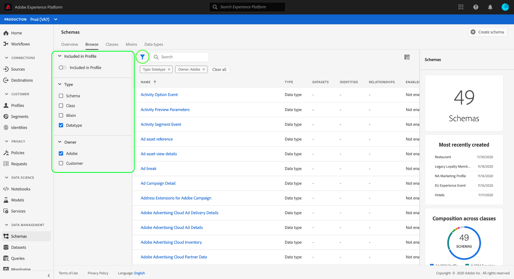
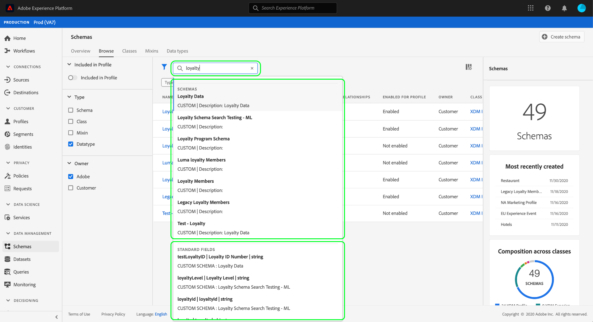
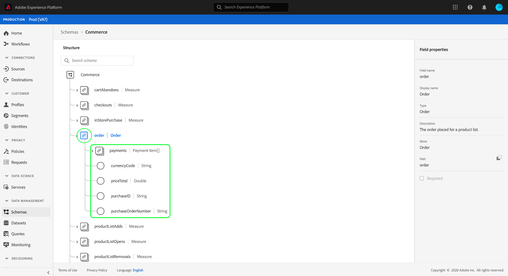
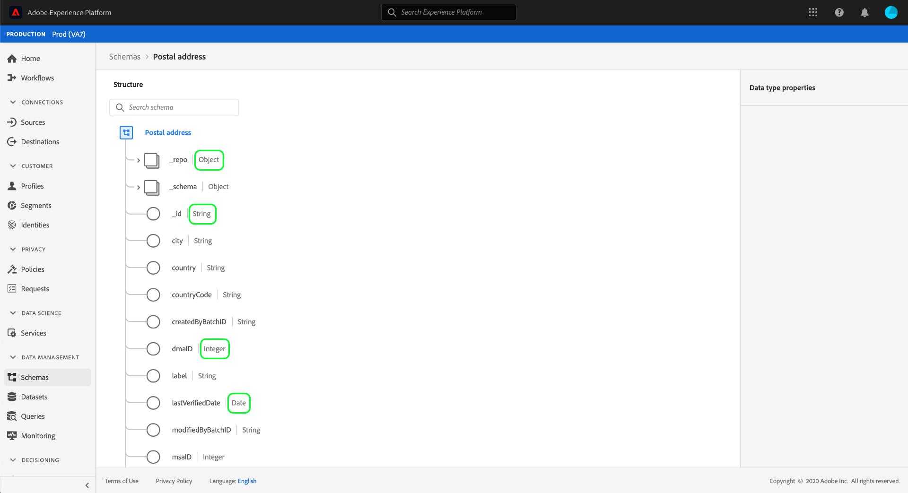
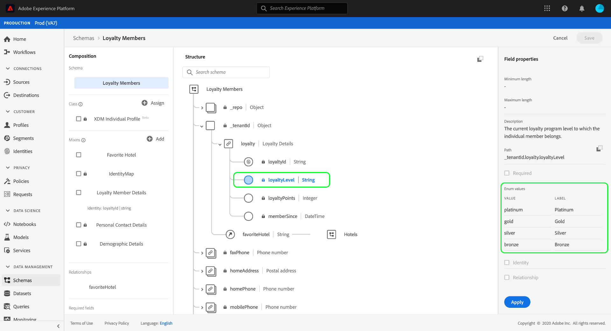
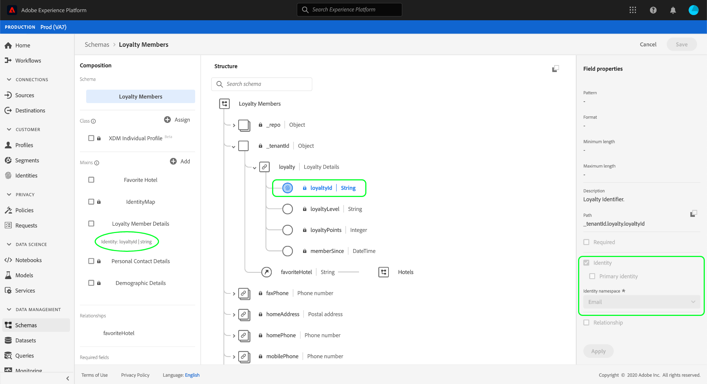
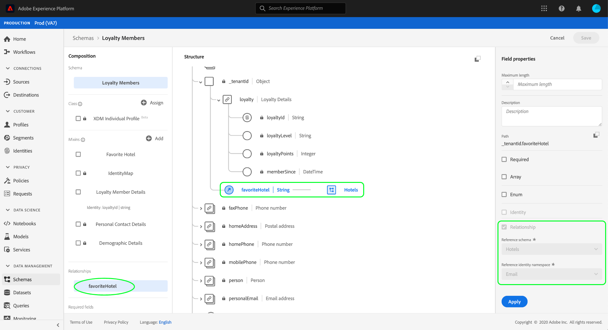

# Explore XDM resources in the UI

In Adobe Experience Platform, all Experience Data Model (XDM) resources are stored in the [!DNL Schema Library], including standard resources provided by Adobe and custom resources defined by your organization. In the Experience Platform UI, you can view the structure and fields of any existing schema, class, mixin, or data type in the [!DNL Schema Library]. This is especially useful when planning and preparing for data ingestion, as the UI provides information on the expected data types and use cases of each field provided by these XDM resources.

This tutorial covers the steps for exploring existing schemas, classes, mixins, and data types in the Experience Platform UI.

## Look up an XDM resource {#lookup}

In the Platform UI, select **[!UICONTROL Schemas]** in the left navigation. The [!UICONTROL Schemas] workspace provides a **[!UICONTROL Browse]** tab to explore all existing XDM resources in your organization, along with additional dedicated tabs for exploring **[!UICONTROL Classes]**, **[!UICONTROL Mixins]**, and **[!UICONTROL Data types]** specifically.

On the [!UICONTROL Browse] tab, you can use the filter icon () to reveal controls in the left rail to narrow down listed results.

For example, to filter the list to only show standard data types provided by Adobe, select **[!UICONTROL Datatype]** and **[!UICONTROL Adobe]** under the **[!UICONTROL Type]** and **[!UICONTROL Owner]** sections, respectively.

The **[!UICONTROL Included in Profile]** toggle allows you to filter results to show only resources that are used in schemas that have been enabled for use in [Real-time Customer Profile](../../profile/home.md).

You can also use the search bar to narrow down results to resources whose names match the search query.

When you have found the resource you want to explore, select its name from the list to view its structure in the canvas.

## Explore an XDM resource in the canvas {#explore}

Once you select a resource, its structure opens in the canvas.

All object-type fields containing sub-properties are collapsed by default when they first appear in the canvas. To show the sub-properties of any field, select the icon next to its name.

### System-generated fields {#system-fields}

Some field names are prepended with an underscore, such as `_repo` and `_id`. These represent placeholders for fields that the system will automatically generate and assign as data is ingested.

As such, most of these fields should be excluded from the structure of your data when ingesting into Platform. The main exception to this rule is the [`_{TENANT_ID}` field](../api/getting-started.md#know-your-tenant_id), which all XDM fields created under your organization must be namespaced under.

### Data types {#data-types}

For each field shown in the canvas, its corresponding data type is shown next to its name, indicating at a glance the type of data that field expects for ingestion.

Any data type that is appended with square brackets (`[]`) represents an array of that particular data type. For example, a data type of **[!UICONTROL String]\[]** indicates that the field expects an array of string values. A data type of **[!UICONTROL Payment Item]\[]** indicates an array of objects that conform to the [!UICONTROL Payment Item] data type.

If an array field is based on an object type, you can select its icon in the canvas to show the expected attributes for each array item.

### [!UICONTROL Field properties] {#field-properties}

When you select the name of any field in the canvas, the right rail updates to show details about that field under **[!UICONTROL Field properties]**. This can include a description of the field's intended use case, default values, patterns, formats, whether or not the field is required, and more.

If the field you are inspecting is an enum field, the right rail will also display the acceptable values the field expects to receive.

### Identity fields {#identity}

When inspecting schemas that contain identity fields, these fields are listed in the left rail under the class or mixin that provides them to the schema. Select the identity field name in the left rail to reveal the field in the canvas, regardless of how deeply it is nested.

Identity fields are highlighted in the canvas with a fingerprint icon (). If you select the identity field's name, you can view additional information such as the [identity namespace](../../identity-service/namespaces.md) and whether or not the field is the primary identity for the schema.

>[!NOTE]
>
>See the guide on [defining identity fields](./fields/identity.md) for more information on identity fields and their relationship with downstream Platform services.

### Relationship fields {#relationship}

If you are inspecting a schema that contains a relationship field, the field will be listed in the left rail under **[!UICONTROL Relationships]**. Select the relationship field name in the left rail to reveal the field in the canvas, regardless of how deeply it is nested.

Relationship fields are also uniquely highlighted in the canvas, showing the name of the destination schema that the field references. If you select the relationship field's name, you can view the identity namespace of the destination schema's primary identity in the right rail.

>[!NOTE]
>
>See the tutorial on [creating a relationship in the UI](../tutorials/create-schema-ui.md) for more information on the use of relationships in XDM schemas.

## Next steps

This document covered how to explore existing XDM resources in the Experience Platform UI. For more information on the different features of the [!UICONTROL Schemas] workspace and [!DNL Schema Editor], see the [[!UICONTROL Schemas] workspace overview](./overview.md).