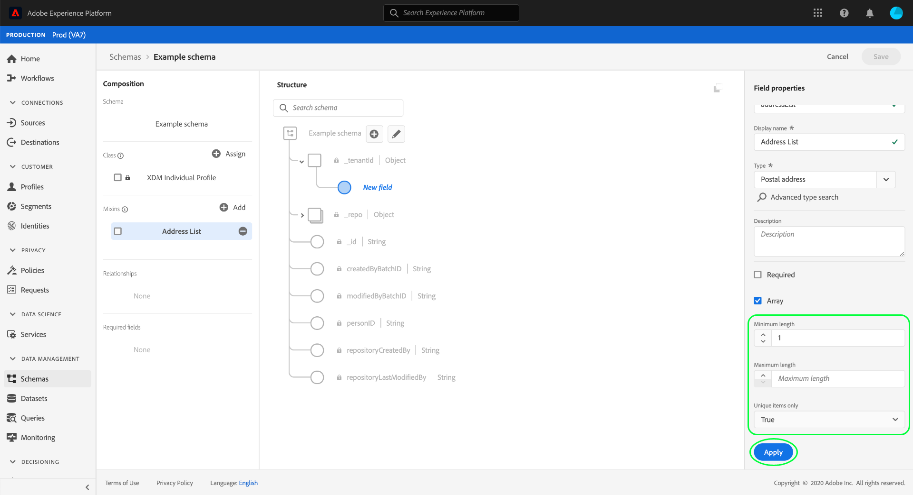
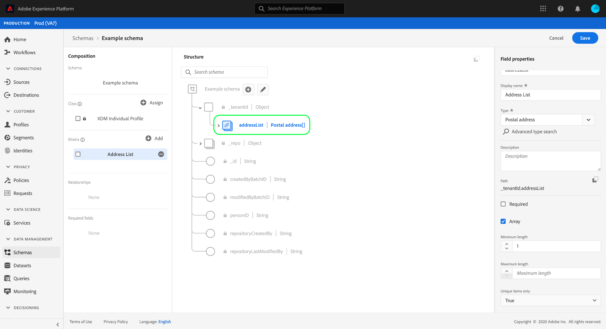

# Define an array field in the UI

When defining an Experience Data Model (XDM) field in the Adobe Experience Platform user interface, you can designate that field as an array.

The contents of the array depend on the [!UICONTROL Type] selected for that field. For example, if a field's [!UICONTROL Type] is set to "[!UICONTROL String]", setting that field as an array will designate the field as an array of strings. If the field's [!UICONTROL Type] is set to a multi-field data type such as "[!UICONTROL Postal address]", then it would become an array of postal-address objects that conform to the data type.

After you have [defined a new field in the UI](./overview.md#define), you can set it as an array field by selecting the **[!UICONTROL Array]** checkbox in the right rail. 

Once the checkbox is selected, additional controls appear in the right rail that allow you to optionally constrain the array further. If you do not wish to enforce a particular constraint, leave the field blank.

The additional configuration controls for arrays are as follows:

| Field property | Description |
| --- | --- |
| [!UICONTROL Minimum length] | The minimum number of items that the array must contain in order for ingestion to be successful. |
| [!UICONTROL Maximum length] | The maximum number of items that the array must contain in order for ingestion to be successful. |
| [!UICONTROL Unique items only] | If set to "[!UICONTROL True]", each item in the array must be unique in order for ingestion to be successful. |

Once you are finished configuring the field, select **[!UICONTROL Apply]** to apply the change to the schema.

The canvas updates to reflect the changes made to the field. Note that the data type displayed next to the field name in the canvas is appended with a pair of square brackets (`[]`), indicating the field represents an array of that data type.

## Next steps

This guide covered how to define an array field in the the UI. See the overview on [defining fields in the UI](./overview.md#special) to learn how to define other XDM field types in the [!DNL Schema Editor].