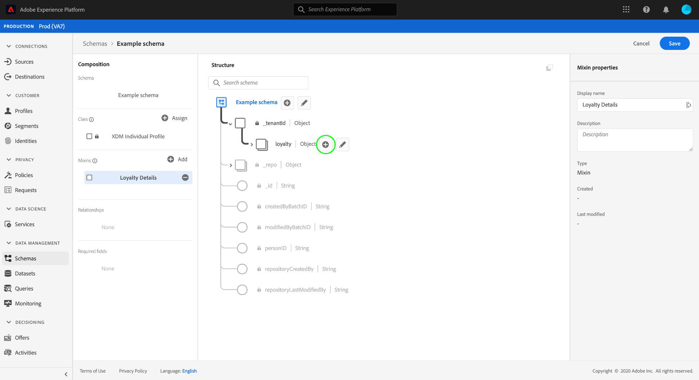
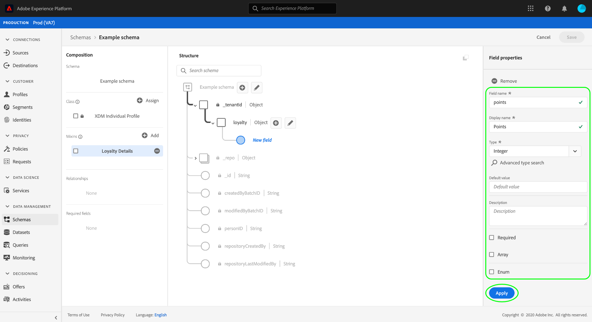

# Define XDM fields in the UI

The [!DNL Schema Editor] in the Adobe Experience Platform user interface allows you to define your own fields within custom Experience Data Model (XDM) classes and mixins. This guide covers the steps for defining XDM fields in the UI, including the available configuration options for each field type.

## Prerequisites

This guide requires a working understanding of XDM System. Refer to the [XDM overview](../../home.md) for an introduction to the role of XDM within the Experience Platform ecosystem, and the [basics of schema composition](../../schema/composition.md) to learn how classes and mixins contribute fields to XDM schemas.

While not required for this guide, it is recommended that you also follow the tutorial on [composing a schema in the UI](../../tutorials/create-schema-ui.md) to familiarize yourself with the various capabilities of the [!DNL Schema Editor].

## Select a resource to add fields to {#select-resource}

To define new XDM fields in the UI, you must first open a schema within the [!DNL Schema Editor]. Depending on what schemas are currently available to you in the [!DNL Schema Library], you can choose to [create a new schema](../resources/schemas.md#create) or [select an existing schema to edit](../resources/schemas.md#edit).

Once you have the [!DNL Schema Editor] open, use the left rail to select the class or mixin that you want to define fields for. If the resource is a custom resource defined by your organization, controls to add or edit fields appear in the canvas. These controls appear next to the name of the schema, as well as any object-type fields that have been defined under the selected class or mixin.

>[!NOTE]
>
>If the class or mixin you select is a core resource provided by Adobe, it cannot be edited and therefore the controls shown above will not appear. If the schema you want to add fields to is based on a core XDM class and does not contain any custom mixins, you can [create a new mixin](../resources/mixins.md#create) to add to the schema instead.

To add a new field to the resource, select the **plus (+)** icon next to the schema's name in the canvas, or next to the object-type field that you want to define the field under.

## Define a field for a resource {#define}

After selecting the **plus (+)** icon, a **[!UICONTROL New field]** appears in in the canvas, located within a root-level object that is namespaced to your unique tenant ID (shown as `_tenantId` in the example below). All fields that are added to a schema through custom classes and mixins are automatically placed within this namespace to prevent conflicts with other fields from Adobe-provided classes and mixins.

In the right rail under **[!UICONTROL Field properties]**, you can configure the details of the new fields. The following information is required for each field:

| Field property | Description |
| --- | --- |
| [!UICONTROL Field name] | A unique, descriptive name for the field. Note that the field's name cannot be changed once the schema has been saved.  The name should ideally be written in camelCase. It may contain alphanumeric, dash, or underscore characters, but it **may not** start with an underscore.<ul><li>**Correct**: `fieldName`</li><li>**Acceptable:** `field_name2`, `Field-Name`, `field-name_3`</li><li>**Incorrect**: `_fieldName`</li></ul> |
| [!UICONTROL Display name] | A human-friendly name for the field. |
| [!UICONTROL Type] | The type of data the field will contain. From this dropdown menu, you can select one of the [standard scalar types](../../schema/field-constraints.md) supported by XDM, or one of the multi-field [data types](../resources/data-types.md) that have been previously defined in the [!DNL Schema Registry].  You can also select **[!UICONTROL Advanced type search]** to search and filter existing data types and locate the desired type easier. |

You can also provide an optional human-readable **[!UICONTROL Description]** to the field to provide more context as to the field's intended use case.

>[!NOTE]
>
>Depending on the **[!UICONTROL Type]** you selected for the field, additional configuration controls may appear in the right rail. See the section on [type-specific field properties](#type-specific-properties) for more information on these controls.
>
>The right rail also provides checkboxes for designating special field types. See the section on [special field types](#special) for more information.

Once you have finished configuring the field, select **[!UICONTROL Apply]**.

The canvas updates to show the field's name and type, and the right rail now lists the field's path in addition to its other properties.

You can continue to follow the steps above to add more fields to the schema. Once the schema is saved, its base class and mixins are also saved if any changes have been made to them.

>[!NOTE]
>
>Any changes you make to the mixins or class of one schema will be reflected in all other schemas that employ them.

## Type-specific field properties {#type-specific-properties}

When defining a new field, additional configuration options may appear in the right rail depending on the **[!UICONTROL Type]** you choose for the field. The following table outlines these additional field properties along with their compatible types:

| Field property | Compatible types | Description |
| --- | --- | --- |
| [!UICONTROL Default value] | [!UICONTROL String], [!UICONTROL Double], [!UICONTROL Long], [!UICONTROL Integer], [!UICONTROL Short], [!UICONTROL Byte], [!UICONTROL Boolean] | A default value that will be assigned to this field if no other value is provided during ingestion. This value must conform to the field's selected type. |
| [!UICONTROL Pattern] | [!UICONTROL String] | A [regular expression](https://developer.mozilla.org/en-US/docs/Web/JavaScript/Guide/Regular_Expressions) that the value for this field must conform to in order to be accepted during ingestion. |
| [!UICONTROL Format] | [!UICONTROL String] | Select from a list of pre-defined formats for strings that the value must conform to. Available formats include: <ul><li>[[!UICONTROL date-time]](https://tools.ietf.org/html/rfc3339)</li><li>[[!UICONTROL email]](https://tools.ietf.org/html/rfc2822)</li><li>[[!UICONTROL hostname]](https://tools.ietf.org/html/rfc1123#page-13)</li><li>[[!UICONTROL ipv4]](https://tools.ietf.org/html/rfc791)</li><li>[[!UICONTROL ipv6]](https://tools.ietf.org/html/rfc2460)</li><li>[[!UICONTROL uri]](https://tools.ietf.org/html/rfc3986)</li><li>[[!UICONTROL uri-reference]](https://tools.ietf.org/html/rfc3986#section-4.1)</li><li>[[!UICONTROL url-template]](https://tools.ietf.org/html/rfc6570)</li><li>[[!UICONTROL json-pointer]](https://tools.ietf.org/html/rfc6901)</li></ul> |
| [!UICONTROL Minimum length] | [!UICONTROL String] | The minimum number of characters the string must contain for the value to be accepted during ingestion. |
| [!UICONTROL Maximum length] | [!UICONTROL String] | The maximum number of characters the string must contain for the value to be accepted during ingestion. |
| [!UICONTROL Minimum value] | [!UICONTROL Double] | The minimum value for the Double to be accepted during ingestion. If the ingested value exactly matches the one entered here, then the value is accepted. |
| [!UICONTROL Maximum value] | [!UICONTROL Double] | The maximum value for the Double to be accepted during ingestion. If the ingested value exactly matches the one entered here, then the value is accepted. |
| [!UICONTROL Exclusive minimum value] | [!UICONTROL Double] | The maximum value for the Double to be accepted during ingestion. If the ingested value exactly matches the one entered here, then the value is rejected. |
| [!UICONTROL Exclusive maximum value] | [!UICONTROL Double] | The maximum value for the Double to be accepted during ingestion. If the ingested value exactly matches the one entered here, then the value is rejected. |

## Special field types {#special}

The right rail provides several checkboxes for designating special roles for the selected field. The use cases for some of these options involve important considerations regarding your data modeling strategy and how you intend to use downstream Platform services.

To learn more about these special types, refer to the following documentation:

* [[!UICONTROL Required]](./required.md)
* [[!UICONTROL Array]](./array.md)
* [[!UICONTROL Enum]](./enum.md)
* [[!UICONTROL Identity]](./identity.md) (Available only for string fields)
* [[!UICONTROL Relationship]](./relationship.md) (Available only for string fields)

While technically not a special field type, it is also recommended that you visit the guide on [defining object-type fields](./object.md) to learn more about defining nested sub-fields if your schema structures.

## Next steps

This guide provided an overview of how to define XDM fields in the UI. Remember that fields can only be added to schemas through the use of classes and mixins. To learn more about how to manage these resources in the UI, see the guides on creating and editing [classes](../resources/classes.md) and [mixins](../resources/mixins.md).

For more information on the capabilities of the [!UICONTROL Schemas] workspace, see the [[!UICONTROL Schemas] workspace overview](../overview.md).